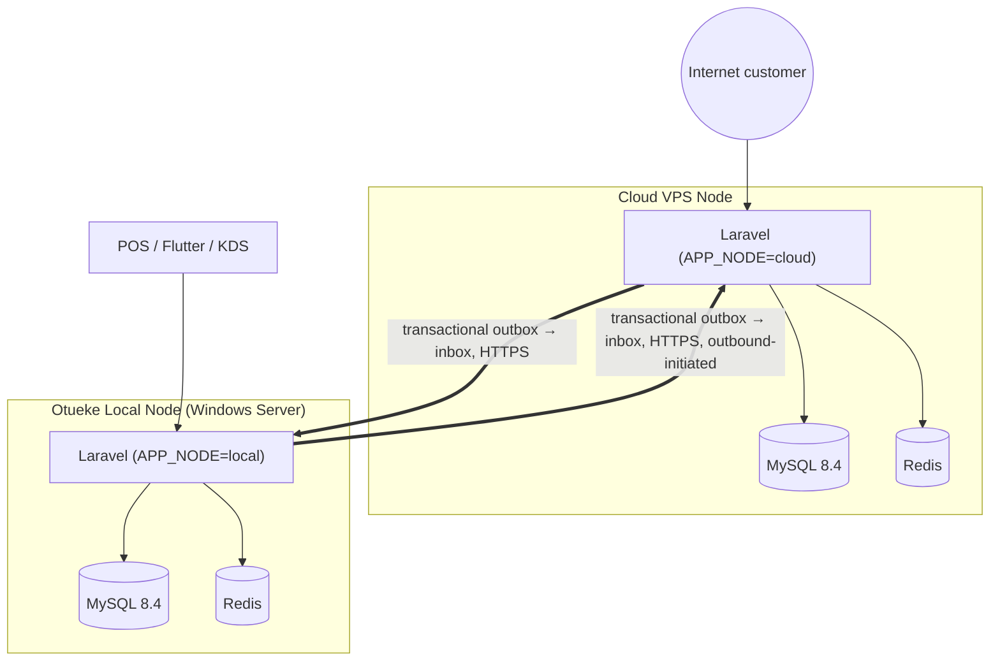

# ADR-0013: Dual-node local-first/cloud-first deployment with transactional event synchronization

Status: Accepted
Date: 2026-09-22
Deciders: 007 Resort & Spa (owner)

## Context

[ADR-0005](0005-site-authoritative-local-first-with-outbound-sync.md) already established that the property must keep operating without internet and that the local server should never be exposed to the internet, with sync flowing outbound from site to cloud. That ADR's mechanism (outbox/inbox, UUIDs, explicit conflict states) is retained and made concrete here, now that the backend is Laravel and the physical deployment shape (Windows Local Server + Linux VPS) is settled ([ADR-0010](0010-cloud-hosting-platform.md), [ADR-0012](0012-migrate-backend-to-laravel.md)).

The deeper problem this ADR resolves explicitly, which [ADR-0005](0005-site-authoritative-local-first-with-outbound-sync.md) named but didn't fully specify: the platform has **scarce, contended resources** — sports slots, appointment times, ticket capacity, inventory, equipment — that both channels (Reception, locally, and the public website, remotely) can attempt to consume simultaneously. Two independently-writable databases that later reconcile cannot prevent a double booking that already happened on both sides before reconciliation ran. This is not solved by keeping two databases in sync faster; it requires one of the two nodes to hold real authority over each contended resource at the moment of commitment.

## Decision

### 1. Two nodes, one Laravel codebase

- **Otueke Local Node**: the property's Windows Server, running the same Laravel codebase, MySQL 8.4, Redis, queue workers, scheduler, and real-time service. Configured via `APP_NODE=local` (or equivalent environment discriminator — exact variable name decided at implementation time, but the discriminator itself is required).
- **Cloud VPS Node**: a Linux VPS with root/administrative access (see [25 — VPS Production Deployment Spec](../architecture/25-vps-production-deployment.md)), running the same Laravel codebase, its own MySQL 8.4 + Redis, configured via `APP_NODE=cloud`.
- **One codebase, not two applications.** Business rules, validation, authorization, and domain logic are identical on both nodes; only which modules are "authoritative" for a given entity, and which external integrations are reachable (payment webhooks terminate at Cloud; the biometric terminal is reachable only from Local), differ by configuration — the same pattern already used for the ASP.NET Core Site/Cloud deployment-mode split ([architecture/01 §4](../architecture/01-architecture-overview.md#4-deployment-modes-of-the-api), carried forward).

### 2. No unrestricted database mirroring

MySQL master/master replication (or any raw row-copy mechanism) is **explicitly rejected** as the synchronization mechanism — it cannot express "who has authority over this specific write right now," which is exactly what prevents a double booking. Synchronization happens at the **application/domain event level**, using a transactional **outbox/inbox** pattern (detailed in [Outbox/Inbox Design](../architecture/sync/outbox-inbox-design.md) and the [Synchronization Event Catalogue](../architecture/sync/event-catalogue.md)).

### 3. Domain authority, not blanket authority

Neither node is "authoritative for everything." Authority is assigned **per domain**, recorded in the [Domain Authority Matrix](../architecture/23-domain-authority-matrix.md):

- **Local-authoritative**: waiter orders, KDS state, bar/kitchen dispensing, in-person cash transactions, attendance, local stock movements, physical ticket/entitlement validation, physical equipment release/return.
- **Cloud-authoritative**: online bookings' payment confirmation, public website activity, online membership purchases, online customer accounts.
- **Shared, contended resources requiring explicit concurrency protection across both entry points** (bookings, ticket/slot capacity, selected stock): the check-and-reserve step is atomic and happens against **one** authoritative decision point per resource — normally Cloud, when reachable, per the [Booking Authority & Offline Allocation strategy](../architecture/sync/booking-authority-and-offline-allocation.md), which also defines the explicit, configurable offline behavior when it is not reachable.

### 4. Idempotent, ordered-safe, observable synchronization

- Every sync event carries a UUID `event_id`, is deduplicated on receipt (an `event_id` seen twice is a no-op, never a double-apply), and is applied inside the same kind of transaction discipline already used for the audit log and idempotency-key handling in the existing (ASP.NET Core) Phase 1 work — the *pattern* survives the backend-language change even though the code is reimplemented.
- Entity versioning (not raw timestamps) protects against out-of-order event application.
- Sync state (`LOCAL → QUEUED → SYNCING → SYNCED`, plus `CONFLICT`/`FAILED`) is visible to IT/Admin, retryable, and never silently drops a business transaction — see [Sync Observability](../architecture/sync/heartbeat-and-node-health.md#4-observability-requirements).
- A **heartbeat** mechanism ([Heartbeat / Node Health spec](../architecture/sync/heartbeat-and-node-health.md)) lets Cloud know Local's liveness with a configurable staleness threshold, used specifically to gate immediate-fulfilment online orders (not to gate the whole website) when Local has been unreachable too long.

### 5. The local server is never publicly exposed

Unchanged from [ADR-0005](0005-site-authoritative-local-first-with-outbound-sync.md): the public website and online customers talk **only** to Cloud. Local's MySQL, Redis, and internal ports are never internet-reachable. The sync channel between the two nodes is mutually authenticated HTTPS (see [Local/Cloud Security Model](../architecture/17-security-model.md), to be extended with node-to-node auth details during implementation).

## Alternatives considered

- **Single node, cloud-hosted, property connects over the internet for everything.** Rejected: this is exactly the "must not depend entirely on internet availability" failure mode the original spec and [ADR-0005](0005-site-authoritative-local-first-with-outbound-sync.md) were written to avoid, and is unchanged by the backend-language decision.
- **Single node, on-site only, with the public website proxied through the property connection.** Rejected: makes the public website depend on the property's internet/Starlink connection and exposes the internal network — precisely what §21 of the original spec and this ADR's §5 forbid.
- **MySQL Group Replication / master-master mirroring between the two nodes.** Rejected per §2 above — already considered and rejected in [ADR-0005](0005-site-authoritative-local-first-with-outbound-sync.md); restated here because it is the most tempting shortcut once both nodes run the identical schema, which makes it worth naming explicitly rather than assuming the earlier rejection is remembered.
- **Cloud-only authority for all bookings, no offline allocation.** Considered as the simplest booking-authority rule. Rejected as the *only* mode: it would mean Reception cannot take a sports booking at all during an internet outage, which fails the "physical operations continue" requirement for a domain (bookings) that is explicitly physical-and-in-person as often as it is online. The [Booking Authority & Offline Allocation strategy](../architecture/sync/booking-authority-and-offline-allocation.md) instead makes offline behavior configurable per resource, defaulting to a safe reduced-capacity allocation rather than an outright block.

## Consequences

- This is materially more implementation work than a single-node design — outbox/inbox tables, event schemas, idempotent consumers, a heartbeat mechanism, and a booking-authority policy engine are all new build, not configuration. This is treated as a Phase 1/2-adjacent architectural foundation, not deferred, because retrofitting authority rules after Catalog/Orders/Booking are built against a naive assumption is far more expensive than building on the correct foundation now.
- Reporting from Cloud must show data freshness explicitly (last heartbeat, last successful sync) rather than presenting Local-originated data as always-current — this is a UI/API requirement on `007resort-admin-web`'s remote instance, not just a backend concern.
- Backup and synchronization are explicitly **not the same thing** — see [Backup and Restore requirements](16-deployment-topology.md) (existing) — a bad synchronized state can propagate through the sync channel, so independent backups on both nodes remain mandatory regardless of sync health.
- This ADR does not change any of the already-accepted domain modeling (facility capability engine, payment/order/booking/ticket state machines, permission model) — it changes *how two deployments of that same domain model stay consistent*, which is additive to, not a replacement of, [architecture/03](../architecture/03-domain-model.md) through [11](../architecture/11-ticket-validation-model.md).
