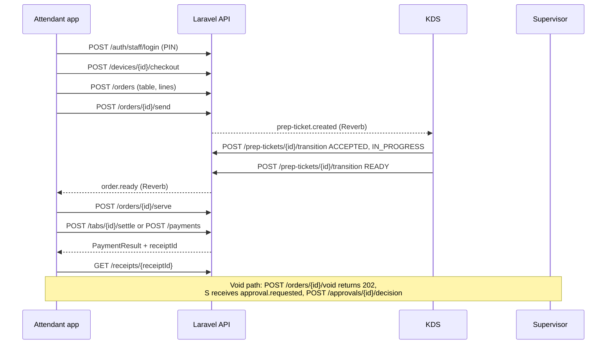
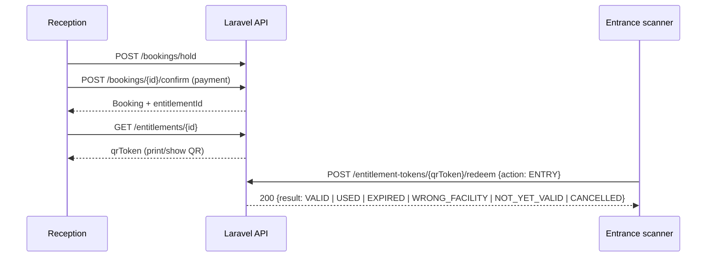
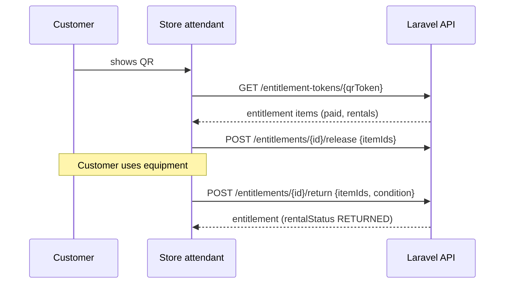

# API contract (v1)

The **contract of record** for the 007 Resort & Spa platform. The Laravel backend, Flutter mobile app, Windows POS, KDS and PHP web apps are all built against these files, in parallel.

| File | Purpose |
| --- | --- |
| [`openapi/v1.yaml`](openapi/v1.yaml) | OpenAPI 3.1: every endpoint, schema, error and example |
| [`realtime.md`](realtime.md) | Laravel Reverb (Pusher protocol) channels, events and payloads |
| [`mvp-flows.md`](mvp-flows.md) | Exact ordered endpoint sequences for the MVP demo slice |
| [`../architecture/15-api-conventions-and-endpoint-map.md`](../architecture/15-api-conventions-and-endpoint-map.md) | Conventions rationale |

The backend implements this spec (and should ship contract tests that validate responses against it); clients generate or hand-write code against it. If the code and the spec disagree, **fix the code or open a PR changing the spec**, never diverge silently.

## Viewing and linting

```bash
# lint (same command CI runs)
npx -y @redocly/cli lint api/openapi/v1.yaml

# browse as HTML
npx -y @redocly/cli preview-docs api/openapi/v1.yaml
npx -y @redocly/cli build-docs api/openapi/v1.yaml -o /tmp/api.html

# generate a client (examples)
npx -y @openapitools/openapi-generator-cli generate -i api/openapi/v1.yaml -g dart-dio -o mobile/lib/api_gen
npx -y openapi-typescript api/openapi/v1.yaml -o kds/src/api.d.ts
```

Known lint warning: `no-ambiguous-paths` on `/payments/webhooks/{provider}` vs `/payments/{paymentId}`. The literal segment wins in Laravel routing; the path is kept for continuity with architecture/15.

## Conventions in one screen

- Base `/api/v1`; JSON `camelCase`; UUIDv7 ids; ISO-8601 UTC timestamps; money is a decimal string (`"1500.0000"`), currency `NGN`. Never parse money as a float; use a decimal type.
- Auth headers: `Authorization: Bearer <accessToken>` plus `X-Device-Token` on device traffic.
- Every mutating request needs `Idempotency-Key`. Aggregates with `rowVersion` return an `ETag` and updates require `If-Match`.
- Errors: `application/problem+json` with a stable `code`. Branch on `code`, show `detail`.
- Lists: `?limit=&cursor=` returns `{ items, nextCursor }`; filters `filter[x]=`, sort `sort=-createdAt`.
- `X-Correlation-Id` is echoed; send one per user action and log it.
- Permissions are strings like `order.void.execute`. Clients gate UI on `staff.permissions`; the server is always the authority.

### Error codes

`unauthenticated`, `token_expired`, `invalid_credentials`, `account_locked`, `device_not_registered`, `device_revoked`, `permission_denied`, `approval_required`, `approval_pending`, `step_up_required`, `validation_failed`, `not_found`, `concurrency_conflict`, `idempotency_key_missing`, `idempotency_key_reused`, `insufficient_stock`, `slot_unavailable`, `hold_expired`, `ticket_used`, `ticket_invalid`, `order_state_invalid`, `payment_state_invalid`, `amount_mismatch`, `balance_changed`, `cash_session_required`, `capability_disabled`, `facility_mismatch`, `offline_not_allowed`, `rate_limited`, `provider_error`, `server_error`. Unknown future codes must be handled as a generic error of their HTTP status class.

| HTTP | Typical codes |
| --- | --- |
| 400 | `idempotency_key_missing` |
| 401 | `unauthenticated`, `token_expired`, `invalid_credentials` |
| 403 | `permission_denied`, `approval_required`, `device_revoked`, `device_not_registered`, `facility_mismatch`, `account_locked` |
| 404 | `not_found` |
| 409 | `concurrency_conflict`, `insufficient_stock`, `slot_unavailable`, `hold_expired`, `balance_changed`, `order_state_invalid`, `payment_state_invalid`, `ticket_used` |
| 412 / 428 | `concurrency_conflict` (`If-Match` mismatch / missing) |
| 422 | `validation_failed`, `amount_mismatch`, `idempotency_key_reused`, `capability_disabled`, `cash_session_required` |
| 429 | `rate_limited` (honour `Retry-After`) |

Scan outcomes for tickets (`VALID`, `USED`, `EXPIRED`, `WRONG_FACILITY`, `NOT_YET_VALID`, `CANCELLED`) are **not** errors: redemption always returns HTTP 200 with `result`.

## Versioning and deprecation policy

- URL-segment major version (`/api/v1`). Within v1 only **additive, backward-compatible** changes: new optional request fields, new response fields, new endpoints, new enum values in responses that clients are told to tolerate (`ProblemCode`, status enums). Clients MUST ignore unknown fields and treat unknown enum values as "other".
- Breaking changes (removing/renaming fields, tightening validation, changing semantics) ship as `/api/v2` with v1 supported for at least **6 months** after v2 is generally available.
- Deprecating an operation: set `deprecated: true` in the spec, add a `Sunset` header (RFC 8594) and `Deprecation` header to responses, and list it in the PR body. Removal only in the next major.
- `GET /system/info` returns `minClientVersion` per client type; a client below it must show an "update required" screen and stop calling mutating endpoints.
- Spec changes go through a PR to this repo touching `api/openapi/v1.yaml`; CI lints it. Backend and client owners are reviewers. Spec `info.version` follows semver (minor for additive, patch for docs/examples).

## Auth walkthrough

1. **Register device** (once): IT admin issues a one-time registration code in the admin UI. The device calls `POST /devices/register` and stores the returned `deviceToken` in secure storage. It sends `X-Device-Token` on every request from then on.
2. **Staff login**: `POST /auth/staff/login` with `credentialType` `PASSWORD`, `PIN` or `NFC_CARD`. PIN and NFC only work from a registered device. Response: `accessToken` (about 15 minutes), `refreshToken`, `staff{id,displayName,roles,permissions}`, `session{id}`.
3. **Use**: `Authorization: Bearer <accessToken>` plus `X-Device-Token`.
4. **Refresh**: before expiry or on `401 token_expired`, call `POST /auth/staff/refresh`. Refresh tokens are single-use and rotate. If one is replayed, the session is revoked. Only one refresh should be in flight per client; queue other requests.
5. **Tablet checkout**: `POST /devices/{id}/checkout` binds staff, facility and shift. Permissions that are facility-scoped are evaluated against that facility.
6. **Step-up**: for sensitive actions when the current user lacks the approve permission, the supervisor authenticates via `POST /auth/staff/step-up` and the single-use `stepUpToken` is sent as `X-Step-Up-Token` on the sensitive request. Alternatively the action returns `202` and a supervisor decides via `POST /approvals/{id}/decision`.
7. **Logout / revoke**: `POST /auth/staff/logout`; admins can `POST /auth/sessions/{id}/revoke` or `POST /devices/{id}/revoke`. After a revoke all calls return `401`/`403 device_revoked` and sockets are closed.

## Offline queue and idempotency guidance (clients)

The Local node lives on the property network and is normally reachable, but Wi-Fi drops and the Cloud link may be down. Mobile and POS must tolerate short outages.

1. **Generate the `Idempotency-Key` when the user action is created**, persist it with the queued request, and reuse it on every retry. Do not regenerate keys on retry. The server replays the original result (same status and body, plus `Idempotent-Replayed: true`) for 72 hours.
2. **Queue only what is safe to queue.** Allowed offline (queued, replayed in order): create order, add/remove line, send order, kitchen transitions, open table, cash tenders. Never queue and never fake: ticket redemption (`ENTRY`) and booking holds (scarce resources; show "need connection"), card/transfer/Paystack payments, refunds, voids and other approvals, login, step-up. Facility `operatingRules.allowOfflineOrders` and `allowOfflinePayments` state what the node allows; a rejected call returns `offline_not_allowed`.
3. **Order matters.** Replay per aggregate in creation order, one at a time per aggregate (an order's create, lines, send). Different aggregates may replay in parallel.
4. **Optimistic concurrency.** Store the last `ETag` per aggregate. On `409/412 concurrency_conflict` fetch the resource, reconcile or surface to the user, and retry with a new `If-Match` (the idempotency key stays the same only if the request body is unchanged; a changed body needs a new key).
5. **Result handling.** `2xx` = done, remove from queue. `4xx` other than `408/409/429` = permanent failure; surface to the user, do not retry blindly. `5xx`, timeouts and network errors = retry with exponential backoff and jitter (1 s to 60 s cap). `429` = wait `Retry-After`.
6. **Client-supplied ids.** Order-line and other create endpoints may accept a client-generated UUID in the future; in v1 the server assigns ids, so the app must key UI state by its local queue id until the response arrives.
7. **Reconnect = reload.** After connectivity returns, drain the queue first, then reload lists (`/orders`, `/tables`, `/kds/...`), then resume realtime (see [`realtime.md`](realtime.md#5-reconnect-and-recovery-mandatory-client-behaviour)).
8. **Clock.** Send `X-Client-Timestamp` (ISO-8601 UTC) on queued requests for audit. It is informational; the server uses its own clock for all business decisions.
9. **Money.** The server computes all totals and tax; the client never submits a price. Show client-side estimates as "estimated" until the response arrives.
10. **Reset.** If the app is force-closed with queued items, they are persisted and resume on next launch after login, and are dropped only when the user explicitly discards them (with a warning).

## Sequence per flow

### Attendant order, KDS, ready, payment



### Sports Entrance scan



### Sports Store release and return


