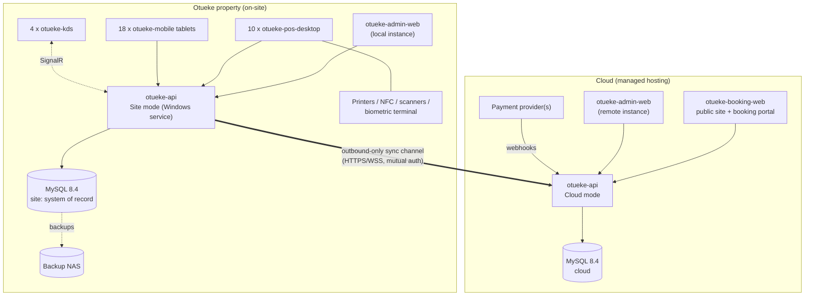
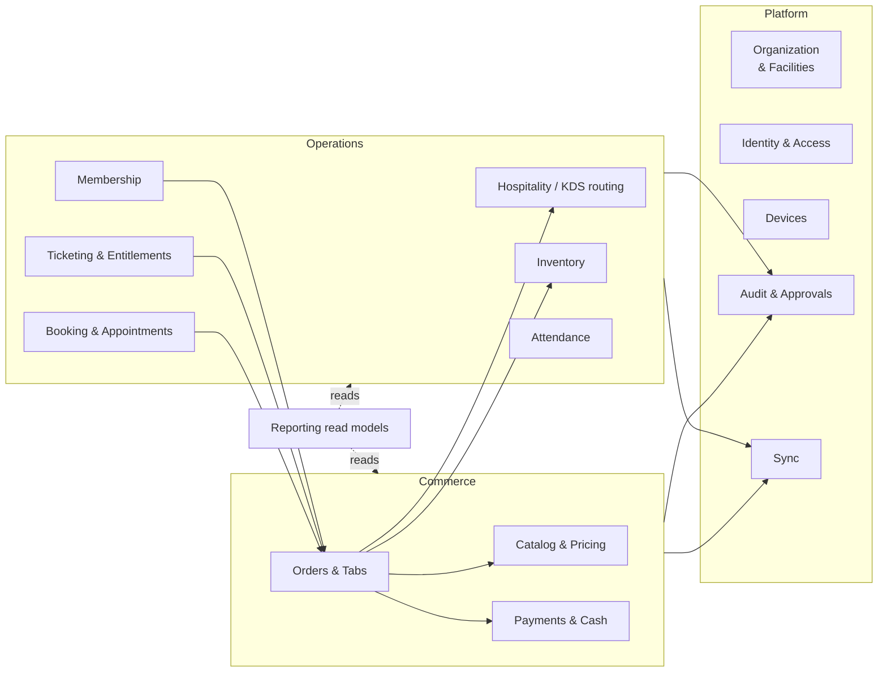

# 01 — Architecture Overview

Status: **DRAFT, awaiting review** · Source requirements: [`spec/`](../spec/) (v1.0, September 2026) and the engineering brief.

## 1. What we are building

A single platform that runs a multi-facility leisure property: payments, POS, hospitality orders, KDS, inventory, bookings, tickets, memberships, staff identity, attendance, management reporting and a public booking website. It must **keep operating when the internet is down**, and it must be able to take on more facilities, more sites and, later, a hotel PMS module without a rebuild.

## 2. Guiding principles

1. **One brain.** The ASP.NET Core API is the only component that runs business rules and the only one that writes operational data. Clients display data, collect input and call the API. ([ADR-0001](../adr/0001-api-is-the-single-business-engine.md))
2. **Configure, don't hardcode.** Facilities are data. A facility's behaviour comes from its enabled **capabilities** and **operating rules**, not from facility-specific code paths. ([05](05-facility-capability-model.md))
3. **Local first.** Every critical operation runs against the on-site server over the LAN. The cloud handles remote access, the public website, online booking, backup and disaster recovery. ([12](12-sync-strategy.md), [13](13-offline-strategy.md))
4. **Money is immutable.** Payments, refunds and reversals are append-only facts. Corrections are new records, never edits.
5. **The database enforces invariants.** Double booking, double redemption, duplicate payments and negative stock races are blocked by constraints and atomic conditional updates. Client-side checks are convenience only.
6. **Everything sensitive is audited**, including the approver where one is required.
7. **Hardware sits behind interfaces.** No business logic depends on a printer, NFC, scanner or biometric vendor.

## 3. System context

The site server is **never** reachable from the internet. The site opens an outbound, authenticated connection to the cloud. It pushes its changes up and pulls down commands such as online bookings, online payments and remote configuration edits. ([ADR-0005](../adr/0005-site-authoritative-local-first-with-outbound-sync.md))

## 4. Deployment modes of the API

Both deployments run the same `otueke-api` binary. `Otueke:DeploymentMode` switches modules on or off:

| Concern | Site mode (on-site server) | Cloud mode |
| --- | --- | --- |
| POS, orders, KDS, tabs, tables | Authoritative | Read-only replica for reporting |
| Inventory | Authoritative | Read-only replica |
| Booking slot allocation | Authoritative (see [10](10-booking-state-model.md)) | Forwards holds to the site in real time; can use a pre-allocated online quota if the site is offline (to be decided) |
| Ticket and entitlement validation | Authoritative | Not performed |
| Online customer accounts, online payment intents, provider webhooks | Receives by sync | Authoritative |
| Staff, roles, configuration | Authoritative; remote edits arrive as versioned commands | Replica; forwards edits |
| Reporting | Local operational reports | Remote management reporting |

## 5. Logical architecture: a modular monolith

`otueke-api` is **one deployable** split into modules with hard boundaries. A module owns its tables and exposes application services. Other modules call those services, never the module's tables. ([ADR-0002](../adr/0002-modular-monolith.md))

The modules talk to each other inside one database transaction when the change must be atomic. For example, closing a retail sale commits the order, payment allocation, stock movement and audit record together. Side effects that can be retried, such as KDS pushes, sync outbox rows, receipts and notifications, run through a **transactional outbox**.

## 6. Key technology choices

| Area | Choice | Status |
| --- | --- | --- |
| Business API | ASP.NET Core on .NET 10 (LTS), C# | Mandated by spec |
| Database | MySQL 8.4 LTS, InnoDB, utf8mb4 | Mandated by spec |
| Real-time | ASP.NET Core SignalR (WebSockets) | Mandated by spec |
| Caching / transient coordination | Redis, only where justified. Not needed for correctness | Spec |
| POS | .NET 10 WPF on Windows | [ADR-0006](../adr/0006-client-technology-choices.md) (proposed) |
| Mobile | Flutter (Android) | Mandated |
| Admin / Booking web | Laravel (PHP 8.4+) as a UI/BFF with **no business database** | [ADR-0007](../adr/0007-php-apps-are-api-clients-without-business-data.md) (proposed) |
| KDS | Browser kiosk client (TypeScript, SignalR JS) | [ADR-0006](../adr/0006-client-technology-choices.md) (proposed) |
| Schema migrations | Versioned SQL scripts in `otueke-api` | [ADR-0004](../adr/0004-schema-migrations-and-data-access.md) (proposed) |
| Data access | EF Core for aggregates, Dapper/SQL for hot paths and reporting | [ADR-0004](../adr/0004-schema-migrations-and-data-access.md) (proposed) |
| Local server OS | Windows Server | Spec |

## 7. Cross-cutting mechanisms

| Mechanism | Summary | Detail |
| --- | --- | --- |
| Identifiers | UUIDv7 (time-ordered) stored as `BINARY(16)` for sync-sensitive rows | [04](04-database-schema.md) |
| Money | `DECIMAL(19,4)` plus a currency code. The API sends amounts as decimal strings | [04](04-database-schema.md) |
| Time | UTC `DATETIME(6)` in storage. ISO-8601 `Z` in the API. Local time only in UIs | [04](04-database-schema.md) |
| Idempotency | `Idempotency-Key` header required on every mutating request. Stored with a request hash and the response | [15](15-api-conventions-and-endpoint-map.md) |
| Concurrency | `row_version` optimistic locking (`ETag` / `If-Match`). Row locks or conditional updates for scarce resources | [18](18-testing-strategy.md) |
| Audit | Append-only, hash-chained `audit_log`, plus an `approval` record for supervisor actions | [17](17-security-model.md) |
| Outbox | `outbox_message`: one table feeding sync, SignalR, receipts and notifications | [12](12-sync-strategy.md) |
| Observability | Serilog JSON logs, OpenTelemetry traces/metrics, correlation IDs from client to DB | [17](17-security-model.md) |

## 8. Out of scope for Phase 1

The hotel PMS (rooms, reservations, housekeeping, key cards, folios). The facility model, `site_id` scoping, the entitlement model and the order/folio split leave room for it to be added later as a module ([spec §21](../spec/)).

## 9. Architecture document set

| # | Document |
| --- | --- |
| 01 | Architecture overview (this document) |
| 02 | [Repository map](02-repository-map.md) |
| 03 | [Entity / domain model](03-domain-model.md) |
| 04 | [Initial MySQL schema design](04-database-schema.md) and [draft DDL](../database/schema-draft-v0.sql) |
| 05 | [Facility capability model](05-facility-capability-model.md) |
| 06 | [Roles and permissions matrix](06-roles-permissions.md) |
| 07 | [Payment state model](07-payment-state-model.md) |
| 08 | [Order state model](08-order-state-model.md) |
| 09 | [Inventory movement model](09-inventory-movement-model.md) |
| 10 | [Booking state model](10-booking-state-model.md) |
| 11 | [Ticket / entitlement validation model](11-ticket-validation-model.md) |
| 12 | [Sync strategy](12-sync-strategy.md) |
| 13 | [Offline strategy](13-offline-strategy.md) |
| 14 | [API module map](14-api-module-map.md) |
| 15 | [API conventions and initial endpoint map](15-api-conventions-and-endpoint-map.md) |
| 16 | [Deployment topology](16-deployment-topology.md) |
| 17 | [Security model](17-security-model.md) |
| 18 | [Testing strategy](18-testing-strategy.md) |
| 19 | [Implementation milestones](19-milestones.md) |
| 20 | [Ambiguities and open questions](20-open-questions.md) |
