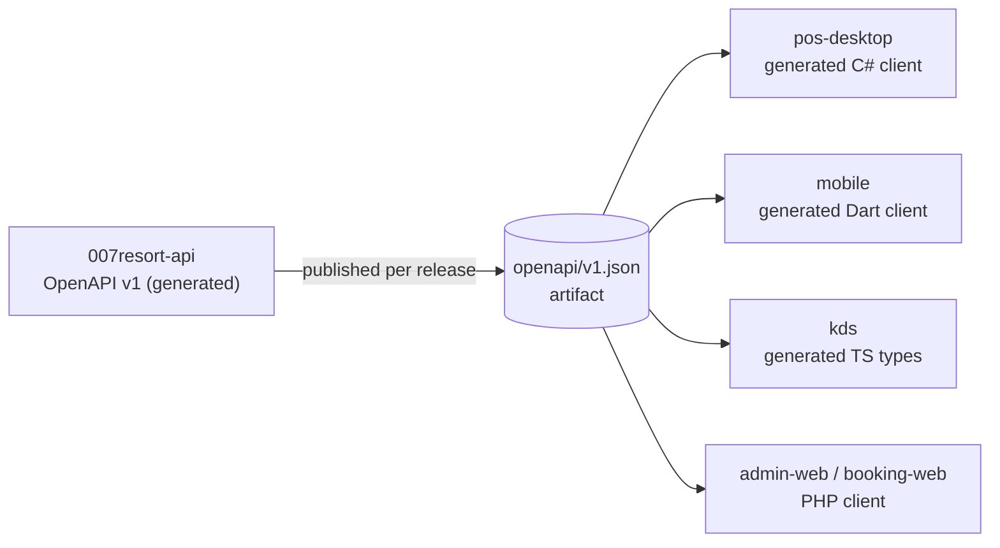

# 02 — Repository Map

All repositories are **private** under `github.com/prinzderick`. `main` is protected once scaffolding is in place. Work happens on `feature/*`, `fix/*`, `docs/*` and `chore/*` branches and merges through pull requests with green CI.

| Repository | Stack | Owns | Must NOT |
| --- | --- | --- | --- |
| `007resort-api` | .NET 10, ASP.NET Core, MySQL 8.4 | Schema and migrations, all business rules, authN/authZ, audit, idempotency, sync, SignalR hubs, payment provider integration and webhooks, OpenAPI contract | Contain UI |
| `007resort-pos-desktop` | .NET 10 WPF | Terminal UX, device drivers behind interfaces, encrypted emergency queue, receipt rendering from API data | Hold a database. Calculate prices, tax, discounts or stock. Decide authorization |
| `007resort-mobile` | Flutter (Android) | Attendant, supervisor, Sports Entrance and Sports Store UX. Tablet checkout UX. QR scanning | Re-implement validation, pricing or permission logic |
| `007resort-kds` | TypeScript, Vite, SignalR JS | Station boards, status transition requests, bump UX | Hold payment, pricing or inventory logic |
| `007resort-admin-web` | Laravel (PHP 8.4+) | Management UI, reports, configuration screens, approval queues | Own business tables. Write to the operational DB. Perform financial or stock operations directly |
| `007resort-booking-web` | Laravel (PHP 8.4+) | Public site, customer portal, booking UX, payment redirect UX | Contain booking or availability logic. Receive payment webhooks |
| `007resort-infrastructure` | Compose, PowerShell, YAML | Environment templates, network design, deployment and backup scripts, runbooks | Contain secrets or production credentials |
| `007resort-docs` | Markdown, Mermaid | Architecture, ADRs, workflows, status | Contain secrets |

## Contract flow

- The OpenAPI document generated by `007resort-api` is the **contract of record**. CI in `007resort-api` fails if the document changes without a matching snapshot update, so every contract change is visible in review.
- Breaking changes need a new API version (`/api/v2`) or a deprecation window. Clients pin a contract version.
- Hand-written DTOs in clients are allowed only as thin wrappers over generated types.

## Versioning and releases

| Repository | Versioning | Release artifact |
| --- | --- | --- |
| api | SemVer tags `vX.Y.Z` | Self-contained Windows service zip (site), container image (cloud), `openapi/v1.json` |
| pos-desktop | SemVer | Signed MSIX/installer |
| mobile | SemVer + build number | Signed APK/AAB (sideloaded through MDM, or directly) |
| kds | SemVer | Static bundle, served by the site API or a static host |
| admin-web / booking-web | SemVer | Deployable build (site and cloud) |
| infrastructure | Tags per environment change | n/a |

Client compatibility: the API returns its `apiVersion` and a `minClientVersion` for each client type from `/api/v1/system/info`. Clients below the minimum refuse to transact and ask for an update.
