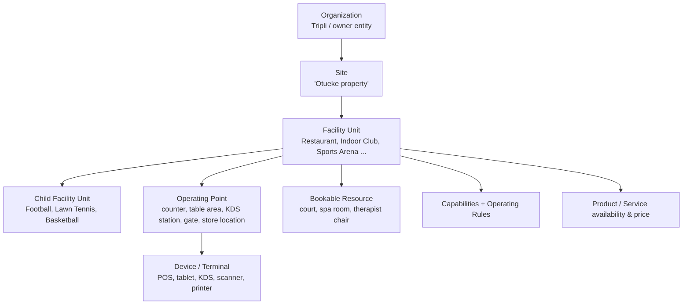
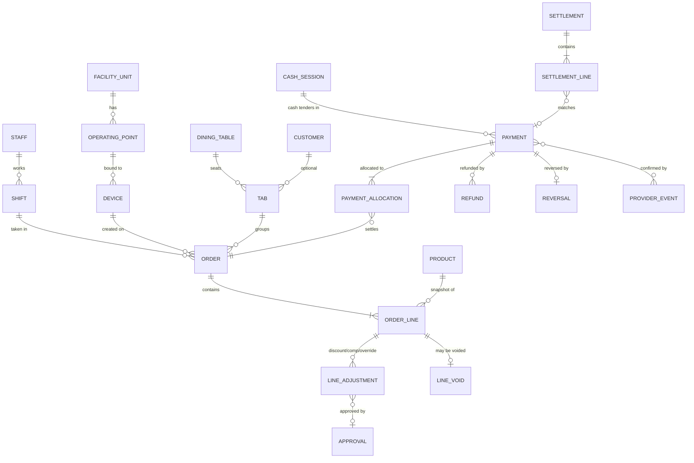
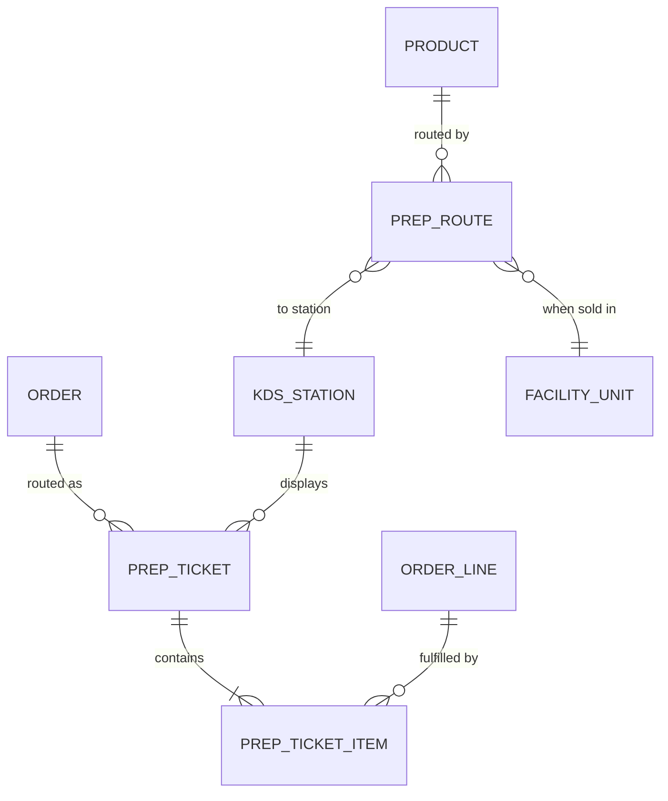
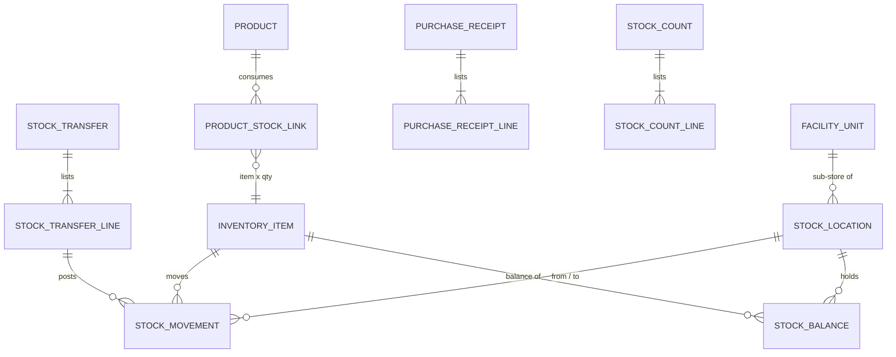
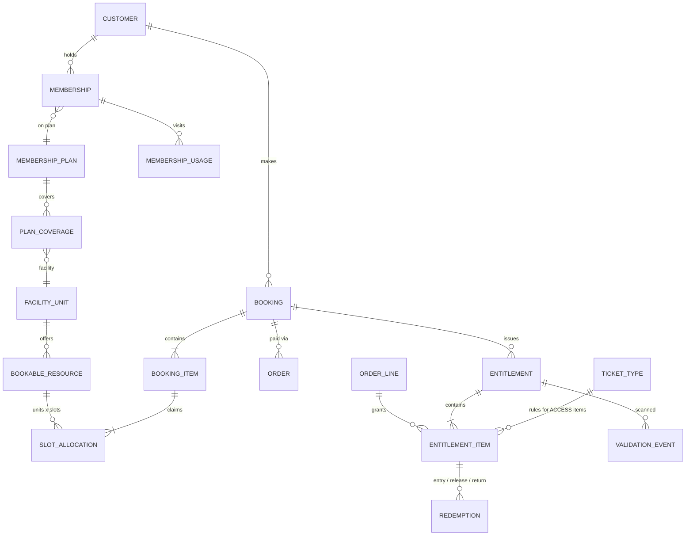

# 03 — Entity / Domain Model

Status: **DRAFT, awaiting review**. Table-level detail is in [04](04-database-schema.md) and the [draft DDL](../database/schema-draft-v0.sql).

## 1. Scoping hierarchy

Almost every operational record carries `organization_id` and `site_id`, plus `facility_unit_id` where it applies. Phase 1 has one organization and one site, but the columns exist from day one. That lets a second property or the hotel join without a data migration.

Facility units form a tree (`parent_id`). Sports Arena is the parent of Football, Lawn Tennis and Basketball. Revenue reporting rolls up the tree.

## 2. Bounded contexts (API modules) and their aggregates

| Module | Aggregates / key entities | Notes |
| --- | --- | --- |
| **Organization** | Organization, Site, FacilityUnit, FacilityCapability, OperatingRule, OperatingPoint, BookableResource | Facility behaviour is configuration ([05](05-facility-capability-model.md)) |
| **Identity & Access** | Staff, UserAccount, Credential (password, PIN, NFC card, TOTP), Role, Permission, RoleAssignment (scoped), Session/RefreshToken, Customer, CustomerAccount | Staff and customers are separate principals |
| **Devices** | Device, DeviceRegistration, DeviceBinding (device → operating point), Peripheral, TabletCheckout | 10 POS, 18 tablets, 4 KDS, scanners, printers, NFC readers, biometric terminal |
| **Catalog & Pricing** | Category, Product (GOOD, SERVICE, TICKET, RENTAL, MEMBERSHIP, FEE), PriceList/Price, TaxRate, ProductFacility (availability), PrepRoute, ProductStockLink | Prices are resolved by the API only |
| **Orders & Tabs** | Order, OrderLine, LineAdjustment (discount, comp, override), LineVoid, Tab, DiningTable, Shift (staff trading session) | Order ≠ payment |
| **Payments & Cash** | Payment (one tender), PaymentAllocation, Refund, Reversal, ProviderEvent (webhook inbox), CashSession (drawer), CashMovement, Settlement, SettlementLine | Append-only financial facts |
| **Hospitality / KDS** | PrepTicket (per station per submission), PrepTicketItem, KdsStation | State machine in [08](08-order-state-model.md) |
| **Inventory** | InventoryItem, StockLocation, StockBalance (projection), StockMovement (ledger), StockTransfer, PurchaseReceipt, StockCount, Supplier, RentalAsset | Ledger is the truth; balance is a guarded projection |
| **Booking** | BookingRule, AvailabilitySchedule, Blackout, Booking, BookingItem, SlotAllocation | DB-enforced slot uniqueness ([10](10-booking-state-model.md)) |
| **Ticketing & Entitlements** | TicketType, Entitlement (the QR/card-holder "pass"), EntitlementItem (ACCESS, RENTAL, GOODS, SERVICE), Redemption (append-only), ValidationEvent | One model for pool tickets, sports passes and store releases ([11](11-ticket-validation-model.md)) |
| **Membership** | MembershipPlan, PlanCoverage, Membership, MembershipStatusHistory, MembershipUsage, MemberCard | Memberships validate through the same entitlement validator |
| **Attendance** | AttendanceDevice, StaffBiometricLink, AttendancePunch (raw), AttendanceDay (derived) | Integration adapter per biometric vendor |
| **Audit & Approvals** | AuditLog (hash-chained), Approval, SecurityEvent | Written in the same transaction as the change |
| **Sync** | SyncNode, OutboxMessage, InboxMessage, SyncCheckpoint, SyncConflict, IdempotencyRecord | [12](12-sync-strategy.md) |
| **Reporting** | Read models / SQL views, daily facility summaries | Read-only |

## 3. Core relationships

### 3.1 Commerce

- **Order vs Payment.** An order records *what was sold*. A payment records *one tender of money received*. `payment_allocation` links them many-to-many. That covers split tenders (one order, several payments), one payment covering several orders (a tab settled at exit), and partial settlement.
- **Tab.** A container for successive orders on an open account, used by Indoor Club and Bush Bar. Settlement allocates payments across the tab's orders.
- **Shift.** A staff member's trading session on a terminal. **Cash session** is the physical drawer session used for reconciliation. A cash session can span several staff shifts; this is configurable per facility.
- Order lines **snapshot** product name, unit price, tax and prep route at the time of sale, so later catalog changes never rewrite history.

### 3.2 Hospitality routing

A prep route maps **product (or category) × selling facility → station**. For example, the same beer routes to the Pool Bar when sold at Pool Area and to the Bush Bar when sold at the Event Centre. Items with no route (retail goods) never create prep tickets.

### 3.3 Inventory

`product_stock_link` separates sellable products from stock items. A bottle sold as one unit, a cocktail consuming several items (BOM, planned for later) and a service that consumes nothing are all expressed the same way.

### 3.4 Booking, tickets, entitlements, membership

**Entitlement** is the single model for "the holder of this code may do X":

| Use | Entitlement | Items |
| --- | --- | --- |
| Pool: 3 children + 2 adults, individual format | 5 entitlements, one QR each | 1 ACCESS item each (ticket type Child/Adult) |
| Pool, combined format | 1 entitlement | 1 ACCESS item with qty 5 |
| Sports booking with rackets and water | 1 entitlement (the booking QR) | ACCESS (court slot), RENTAL x2 rackets, GOODS x2 water |
| Membership | 1 entitlement per member card | Validated against Membership rules |

The Sports Entrance redeems ACCESS items. The Sports Store releases RENTAL and GOODS items and records RENTAL returns. Both write append-only `redemption` rows, guarded by atomic conditional updates.

## 4. Invariants the API guarantees

| # | Invariant | Enforced by |
| --- | --- | --- |
| I-1 | A slot unit can be held by at most one active booking | `UNIQUE(resource_id, slot_start, unit_no)` on `slot_allocation` |
| I-2 | An entitlement item can never be redeemed beyond its quantity | Conditional `UPDATE ... WHERE qty_redeemed + :n <= qty` inside a transaction, plus a check constraint |
| I-3 | A provider payment event is processed at most once | `UNIQUE(provider, provider_event_id)` on `provider_event` |
| I-4 | A retried client request produces exactly one effect | `UNIQUE(scope, idempotency_key)` on `idempotency_record` |
| I-5 | Stock balance equals the sum of its movements | Balance rows are only changed in the same transaction as the ledger row. A nightly reconciliation job checks it |
| I-6 | Stock cannot go negative unless the facility allows it | Conditional update, with a per-location `allow_negative` rule |
| I-7 | Financial rows are never updated or deleted after posting | No UPDATE/DELETE privilege for the app user on ledger tables, plus triggers that reject it |
| I-8 | Payments allocated to an order never exceed its total, except explicit change or overpayment handling | Service check under a row lock on the order |
| I-9 | Sensitive actions carry an approval when policy requires it | Approval FK plus a service-level policy check |
| I-10 | Audit rows are append-only and tamper-evident | Insert-only grants plus a `prev_hash` chain |

## 5. Future hotel PMS fit

A hotel module adds `room`, `room_type`, `reservation`, `folio` and `key_card` in its own module. It reuses FacilityUnit (Hotel), BookableResource (rooms, with night-based slot granularity), Customer, Order/Payment (room charges post orders to a folio-type tab) and Entitlement (key cards as NFC credentials). No Phase 1 table needs restructuring.
