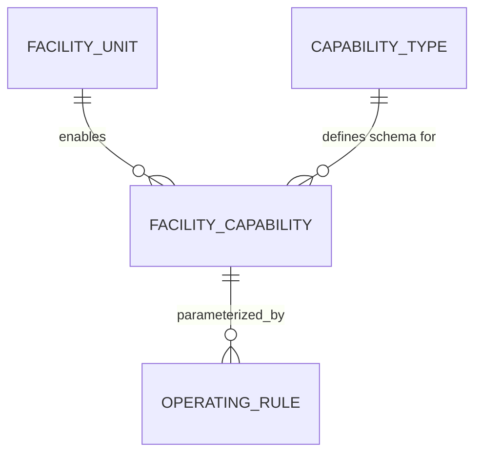

# 05 — Facility Capability Model

Status: **DRAFT, awaiting review**

## 1. Problem

The spec lists ~20 Phase 1 facility areas, each behaving differently (POS vs. no terminal, open tabs vs. pay-first, ticketing vs. none, bookable vs. not). The system must not hardcode `if (facility == "Restaurant")` anywhere. A facility's behaviour is entirely data: which **capabilities** are turned on, and what **operating rules** parameterize them.

## 2. Model

- `capability_type`: a fixed catalog (seeded, not user-editable at runtime): `POS`, `TABLE_SERVICE`, `OPEN_TAB`, `KITCHEN_ROUTING`, `BAR_ROUTING`, `TICKETING`, `TICKET_VALIDATION`, `BOOKING`, `APPOINTMENTS`, `CAPACITY_MANAGEMENT`, `TIME_SLOTS`, `INVENTORY`, `MEMBERSHIP`, `SUBSCRIPTION_BILLING`, `USAGE_LIMITS`, `MEMBER_DISCOUNTS`, `STAFF_ASSIGNMENT`, `BARCODE_SALES`, `QR_VALIDATION`, `RECEIPT_PRINTING`, `PAYMENT_ACCEPTANCE`, `EQUIPMENT_RENTAL`.
- `facility_capability`: which capabilities are **on** for a given `facility_unit`.
- `operating_rule`: a typed key/value row scoped to a `facility_capability` — e.g. `payment_timing = PAY_ON_EXIT` for Indoor Club's `OPEN_TAB`, `validation_mode = ENTRY_EXIT` for Pool's `TICKET_VALIDATION`, `slot_granularity_minutes = 60` for Sports Arena's `TIME_SLOTS`.

Business logic in the API asks "does this facility have capability X, and what does its rule say?" — never "which named facility is this?". A new facility (or the future hotel) is enabled by inserting rows, not by shipping code.

## 3. Phase 1 capability matrix

| Facility | POS | Payment terminal | Tabs | Kitchen/bar routing | Ticketing | Validation | Booking/slots | Inventory | Membership |
| --- | --- | --- | --- | --- | --- | --- | --- | --- | --- |
| Main Reception | ✔ (x2) | ✔ | – | – | ✔ (issues) | – | ✔ (creates) | – | ✔ (sells) |
| Restaurant | ✔ | ✔ | ✔ open tab | ✔ kitchen | – | – | – | ✔ | – |
| Indoor Club | ✔ | ✔ | ✔ pay-on-exit | ✔ bar | – | – | – | ✔ | ✔ discounts |
| Beauty Spa | ✔ | ✔ | – | – | – | – | ✔ appointments | ✔ | ✔ discounts |
| Pool Area | – | – (Reception) | – | – | ✔ (redeemed here) | ✔ entry/exit | – | – | ✔ |
| Pool Bar | – | – (Reception, via Restaurant-style tab or direct order) | ✔ | ✔ bar | – | – | – | ✔ | – |
| Cafe / Cyber Cafe | ✔ | ✔ | – | – | – | – | ✔ time slots (cyber) | ✔ | – |
| Main Kitchen | – | – | – | ✔ (station) | – | – | – | ✔ (sub-store) | – |
| Smaller Kitchen | – | – | – | – (no dedicated KDS Phase 1) | – | – | – | ✔ (sub-store) | – |
| Sports Arena (+ children) | – | – (Reception) | – | – | ✔ (issues at Reception) | ✔ entry | ✔ slots/capacity | – | ✔ |
| Bush Bar / Event Centre | ✔ | ✔ | ✔ | ✔ bar | ✔ (events) | ✔ optional | ✔ event capacity | ✔ | – |
| Salon (Male/Female) | ✔ | ✔ | – | – | – | – | ✔ appointments | ✔ | ✔ discounts |
| Supermarket / Super Store | ✔ (x2) | ✔ | – | – | – | – | – | ✔ | – |
| Sports Store | – | – (Reception) | – | – | – | ✔ (release/return) | – | ✔ rental | – |
| Main Store | – | – | – | – | – | – | – | ✔ (central) | – |
| Accounts / Manager / IT | – | – | – | – | – | – | – | – | – |
| Main Gate | – | – | – | – | – | – (attendance, not entitlement) | – | – | – |

This matrix is seed data, not code. [ADR-0008](../adr/0008-facility-capability-engine.md) records the decision to model capabilities this way instead of per-facility service classes.

## 4. Worked example: Pool Bar has no payment terminal

Pool Bar has `POS` off and `PAYMENT_ACCEPTANCE` off but `TABLE_SERVICE`/`OPEN_TAB`-equivalent routing on. An attendant tablet creates the order against Pool Bar; the order's `payment_facility_unit_id` operating rule points to Main Reception, so settlement happens there. The KDS routing and stock consumption still credit Pool Bar as the selling facility for reporting. The same mechanism gives Sports Arena and Sports Store their "no terminal, pay at Reception" behaviour ([spec §6](../spec/)).
