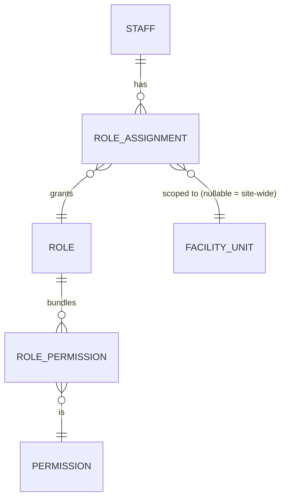

# 06 — Roles and Permissions Matrix

Status: **DRAFT, awaiting review**

## 1. Model

Authorization is **permission-based**, not role-name-based. A role is a named bundle of permissions; a `role_assignment` scopes a role to a staff member **at an organization, site, or facility_unit level**. "Manager" grants nothing by itself — it grants exactly the permissions in its bundle, at the scope assigned. This satisfies the spec requirement that being a Manager must not automatically bypass every control ([spec §16](../spec/), §24).

A permission check is `staff has permission P at scope S (or an ancestor of S)`. Sensitive permissions additionally carry a `requires_approval` flag evaluated per facility's `operating_rule` (some facilities may require supervisor approval for a discount above a threshold; others may not).

## 2. Initial roles → permission bundles

| Role | Typical bundle |
| --- | --- |
| Wait staff | `order.create`, `order.line.add`, `order.line.remove_unsent`, `order.send`, `tab.view_own_facility` |
| Bartender / dispenser | `order.create` (bar-routed), `prep_ticket.view`, `prep_ticket.transition` |
| Kitchen staff | `prep_ticket.view`, `prep_ticket.transition` |
| Cashier | Wait-staff bundle + `payment.take`, `payment.split`, `order.settle`, `cash_session.open`, `cash_session.close`, `receipt.reprint` |
| Storekeeper | `inventory.receive`, `inventory.transfer.create`, `inventory.count.create`, `inventory.adjustment.request` |
| Unit supervisor | Cashier bundle + `order.void.approve`, `order.discount.approve`, `order.price_override.approve`, `order.comp.approve`, `inventory.adjustment.approve`, `staff.clock_correction.approve` |
| Procurement | `inventory.purchase_receipt.create`, `supplier.manage` |
| Accountant | `finance.report.view`, `settlement.reconcile`, `refund.approve` (site-wide), `payment.reversal.approve` |
| Manager | Unit-supervisor bundle at site scope + `staff.manage`, `role_assignment.manage` (below own level), `facility.configure`, `pricing.manage`, `report.view.all` |
| IT / system administrator | `device.register`, `device.revoke`, `session.revoke`, `security_event.view`, `config.manage` — explicitly **excludes** financial and pricing permissions |
| Owner / super admin | All permissions, site + org scope, with MFA required on remote sessions |

Sensitive actions ([spec §16](../spec/)) — void, refund, discount, price change, complimentary item, stock adjustment, manual ticket override — are permissions of their own (e.g. `order.void.execute` vs `order.void.approve`), so a facility can require the *requester* to hold execute and a *different* person to hold approve (see [Approval workflow](#3-approval-workflow)).

## 3. Approval workflow

1. Staff member without the approval permission triggers a sensitive action → API creates the order/adjustment in `PENDING_APPROVAL` and an `approval` row referencing it.
2. A holder of the approval permission (supervisor/manager), authenticated on the same device or their own, approves or rejects.
3. The action only takes effect on approval; the `approval_id` is stored on the resulting `line_adjustment`/`audit_log` row.
4. Facilities can set `operating_rule.approval_threshold_amount` — below the threshold no approval is required, decided by the API against the facility's rule, never by the client.

## 4. Authentication requirements by station type

| Station type | Method |
| --- | --- |
| Fixed POS terminal (10 units) | NFC card **+** PIN/password (never NFC alone) |
| Shared attendant tablet | Staff sign-in (NFC or credentials) at checkout time; session tied to the checkout record |
| Supervisor tablet | Staff sign-in; supervisor actions may re-prompt for PIN ("step-up") |
| Sports Entrance / Sports Store tablet | Device-level operator sign-in; the scan itself authenticates the *entitlement*, not the operator |
| Admin web (remote) | Password + MFA for Owner/Manager/Accounts/IT roles where practical; session timeout; device/session revocation |
| Booking web (customer) | Customer account, separate identity space from staff |

## 5. Device-scoped identity

Every mutating request carries the authenticated staff session **and** the device identity (from device registration, [14](14-api-module-map.md)). A permission can therefore be additionally constrained to "only from a registered device at this facility" — e.g. `order.void.execute` might be deniable from an unregistered or wrong-facility device even if the staff member holds the permission, closing the "borrowed session on the wrong terminal" gap.
