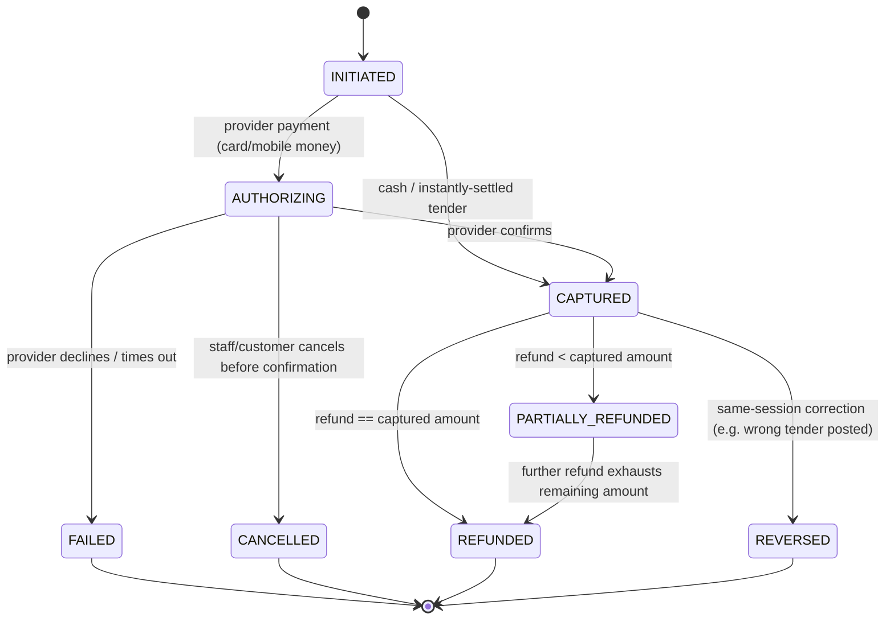
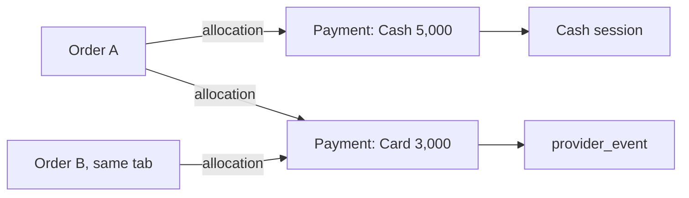

# 07 — Payment State Model

Status: **DRAFT, awaiting review**. Related: [08 Order state](08-order-state-model.md), [04 §3.3](04-database-schema.md#33-provider_event-and-idempotency_record--duplicate-payment-protection).

## 1. Principle

Payment and Order are separate aggregates. A `payment` is one tender attempt; `payment_allocation` rows link it to the order(s) it settles. Financial rows are **never updated in place** — corrections are new `refund` or `reversal` records that reference the original.

## 2. Payment states

- `CAPTURED` is the only state that counts toward order settlement and cash-session totals.
- A `refund` always references the original `payment` and cannot exceed the sum of (captured amount − already refunded). Enforced by a check against a running total under a row lock.
- A `reversal` is used for same-session corrections (wrong payment method posted, mis-keyed amount) and is functionally a full/partial refund with a distinct reason code for reporting, per [spec §11](../spec/) ("financial records must never be silently edited... use reversal/correction records").
- `provider_event` rows (webhooks) drive `AUTHORIZING → CAPTURED/FAILED` transitions; each event is deduplicated by `UNIQUE(provider, provider_event_id)` ([04](04-database-schema.md)).

## 3. Split, multi-order, and tab settlement

- **Split payment**: one order, several `payment` rows, each with its own `payment_allocation` for the portion it covers. The order is `SETTLED` once allocations sum to its total.
- **Tab settlement**: several orders on one tab, one or more payments at exit, each payment's allocation rows spread across the open orders (oldest first, or per staff selection).
- **Overpayment / change**: a cash payment can exceed the amount due; the excess is recorded as `change_given` on the payment, not as a separate liability.

## 4. Duplicate payment protection ([spec §26](../spec/))

| Failure mode | Guard |
| --- | --- |
| Two provider callbacks for the same payment | `UNIQUE(provider, provider_event_id)` on `provider_event`; second insert is caught and ignored, response replayed |
| Network retry causes duplicate POST /payments | `Idempotency-Key` required on the endpoint; `idempotency_record` returns the original response on replay |
| Cashier double-taps "confirm cash" | Client debounces, but the server is the real guard: idempotency key derived from `(order_id, terminal_transaction_nonce)` |
| Concurrent settlement of the same tab from two devices | Order/tab row lock during allocation; second request re-reads updated balance and either succeeds against the remainder or is told the balance changed (`409`) |

## 5. Reconciliation

`settlement` groups captured payments by tender/provider and business day; `settlement_line` matches each to a bank/provider statement reference. Cashier shift reports (declared cash vs. system-recorded cash) and provider settlement reconciliation are reporting views over `payment`, `cash_session`, and `settlement` — never a rewrite of the payment rows themselves ([spec §9 Finance](../spec/)).
