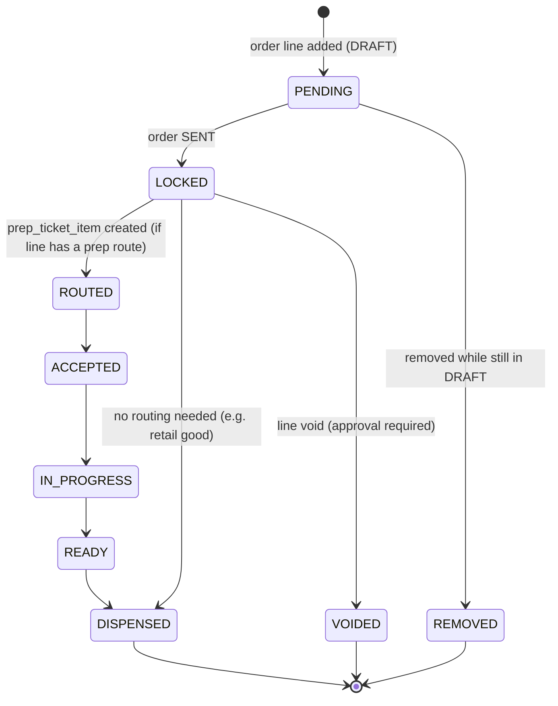

# 08 — Order State Model

Status: **DRAFT, awaiting review**

## 1. Order lifecycle

```mermaid
stateDiagram-v2
  [*] --> DRAFT: staff/attendant starts an order
  DRAFT --> SENT: submitted (lines locked, routed to prep if applicable)
  SENT --> IN_PREPARATION: any prep ticket accepted
  IN_PREPARATION --> READY: all routed items ready
  READY --> SERVED: served/dispensed
  SENT --> SERVED: no routing (retail item, no KDS)
  SERVED --> SETTLED: fully paid via payment_allocation
  DRAFT --> VOIDED: cancelled before send (supervisor approval per facility rule)
  SENT --> VOIDED: cancelled after send (requires approval; stock/prep already committed is reversed)
  SETTLED --> [*]
  VOIDED --> [*]
```

- **DRAFT**: lines can be freely added/removed by the creating staff member. Nothing has been sent to a kitchen/bar and no stock has moved.
- **SENT**: lines are locked (further changes are new lines, not edits, so the prep/audit trail is truthful); routed lines create `prep_ticket`/`prep_ticket_item` rows ([08.1](#2-line-level-and-prep-routing)); stock consumption posts here (configurable: at send, or at settlement, per facility operating rule).
- Payment timing is **configurable per facility** ([spec §11](../spec/)): some facilities require `SETTLED` before `SENT` (pay-first retail); Indoor Club and similar tab facilities allow many `SENT`→`SERVED` orders on an open tab before a single settlement closes them all.
- **VOIDED** after send requires the void permission/approval ([06](06-roles-permissions.md)) and posts compensating stock/prep-ticket cancellation events — it is a new transition with its own audit trail, not a deletion.

## 2. Line-level and prep routing

`line_void` is a distinct row (never a delete) referencing the approval that authorized it, satisfying the "void" sensitive-action requirement ([spec §16](../spec/)). `line_adjustment` (discount, comp, price override) is likewise append-only, layered on top of the line's snapshot price rather than mutating it.

## 3. Concurrency

- Adding/removing lines on a `DRAFT` order is single-writer in practice (one device owns the draft), but the API still uses `row_version` optimistic concurrency to reject a stale write (e.g. a tablet reconnecting after a drop) rather than silently overwriting another device's edit.
- Transitioning `DRAFT → SENT` and any stock-affecting transition run inside one DB transaction with the relevant `stock_balance` row locks ([09](09-inventory-movement-model.md)), so a network-retry-induced double-send is caught by the idempotency key on the send endpoint, not by hoping the client only clicks once.
