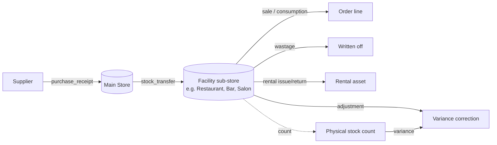

# 09 — Inventory Movement Model

Status: **DRAFT, awaiting review**. Schema detail: [04 §3.4](04-database-schema.md#34-stock_movement--stock_balance--concurrent-stock-deductions).

## 1. Flow



Every movement is one `stock_movement` row: item, source location (nullable for a pure receipt), destination location (nullable for a pure consumption), quantity, actor, timestamp and a `reason` + `reference_type/reference_id` pointing back to the originating record (`purchase_receipt`, `stock_transfer`, `order`, `stock_count`, manual adjustment) — satisfying [spec §12](../spec/)'s "every movement records item, source, destination, quantity, actor, timestamp, reason/reference".

## 2. Movement reasons

| Reason | Source → Destination | Trigger |
| --- | --- | --- |
| `RECEIPT` | Supplier → Main Store | `purchase_receipt` posted |
| `TRANSFER_OUT` / `TRANSFER_IN` | Main Store → Facility (paired rows) | `stock_transfer` posted |
| `SALE` | Facility location → (consumed) | Order line sent/settled (per facility rule) |
| `WASTAGE` | Facility location → (written off) | Storekeeper/supervisor entry |
| `ADJUSTMENT` | Either direction | Approved correction (requires the stock-adjustment permission, [06](06-roles-permissions.md)) |
| `COUNT` | Either direction | Physical count variance posting |
| `RENTAL_OUT` / `RENTAL_IN` | Facility (Sports Store) ↔ Customer | Equipment release / return against an `entitlement_item` ([11](11-ticket-validation-model.md)) |

There is **one** facility sub-store per operational area (e.g. Restaurant, Main Kitchen, Smaller Kitchen, Bush Bar, Salon, Supermarket, Sports Store) managed from the existing facility POS/workstation — the spec is explicit that no separate sub-store computers are introduced ([spec §12](../spec/)).

## 3. Concurrency: the "last unit" test

Two POS terminals selling the last bottle of an item simultaneously:

```mermaid
sequenceDiagram
  participant T1 as Terminal A
  participant T2 as Terminal B
  participant DB as stock_balance (row for item+location)
  T1->>DB: UPDATE ... SET qty_on_hand = qty_on_hand - 1 WHERE qty_on_hand - 1 >= 0
  T2->>DB: UPDATE ... SET qty_on_hand = qty_on_hand - 1 WHERE qty_on_hand - 1 >= 0
  DB-->>T1: 1 row affected (wins, InnoDB serializes on the row)
  DB-->>T2: 0 rows affected
  T2-->>T2: Service returns 422 Insufficient stock; UI shows "out of stock", order line rejected
```

Locations with `allow_negative = true` (rare, policy-driven) skip the guard clause but still post the movement, so the resulting negative balance is visible for correction rather than silently blocked. `stock_balance` is a projection of `stock_movement`; a nightly job recomputes and compares to catch drift (invariant I-5, [03](03-domain-model.md#4-invariants-the-api-guarantees)).

## 4. Recipe/BOM

Phase 1 treats most products as one sellable unit ↔ one stock item via `product_stock_link`. Multi-ingredient recipe consumption (e.g. a cocktail consuming several stock items per sale) is modeled by `product_stock_link` already supporting a quantity multiplier per link, but automatic BOM explosion beyond simple multi-item links is an explicit **later enhancement**, per [spec §8](../spec/).
