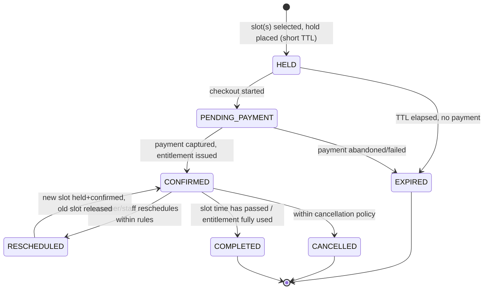
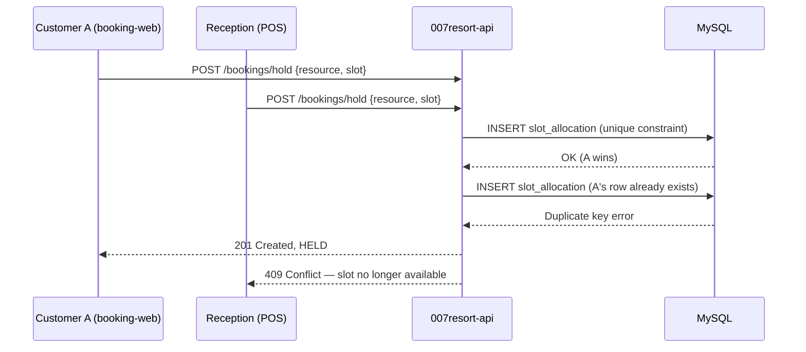

# 10 — Booking State Model

Status: **DRAFT, awaiting review**

## 1. States

- A `HELD` booking claims `slot_allocation` rows via the unique `(resource_id, unit_no, slot_start)` constraint ([04](04-database-schema.md#31-slot_allocation--prevents-double-booking)) — this is what makes the hold real, not a flag in application memory.
- `EXPIRED` holds are swept by a background job that deletes/cancels the `slot_allocation` rows, freeing the slot.
- `CONFIRMED` issues one `entitlement` (with one or more `entitlement_item` rows for ACCESS/RENTAL/GOODS as configured, [03 §3.4](03-domain-model.md#34-booking-tickets-entitlements-membership)).
- Cancellation/reschedule rules (cutoff window, fee, blackout dates) are `booking_rule` data per resource/facility, not code.

## 2. Booking modes

| Mode | Example | Mechanism |
| --- | --- | --- |
| Whole-resource booking | Renting the entire football pitch for a slot | `unit_no` fixed at 1; one `slot_allocation` blocks the whole resource |
| Individual capacity | Pool ticket with a max headcount per time window | `bookable_resource.capacity`; each booking item claims capacity units, no per-unit slot row, guarded by a capacity check under a row lock, or by generating one `slot_allocation` row per capacity unit for a hard per-unit guarantee (decision left to the migration review, [20](20-open-questions.md)) |
| Time slot | Lawn tennis court, hourly slots | `slot_allocation` per `(resource, unit_no, slot_start)` |
| Both | A court bookable whole *or* by individual lane/time | Combination of the above per `booking_rule` |

## 3. Preventing the "two users, one final slot" race

The same booking engine and the same `slot_allocation` table serve **both** the public website and Reception — the spec's explicit requirement that they must share one backend to prevent double booking ([spec §10](../spec/), §13). There is no separate "online availability cache" that can drift from Reception's view; both read and write the same rows, with a short-lived `HELD` cache only for UI display of remaining capacity, always re-validated at hold time.

## 4. Sports flow tie-in

Reception's sports flow (choose resource → slot → optional rental/store items → payment → QR) composes a `HELD` booking, appends `RENTAL`/`GOODS` items to the same `entitlement`, then confirms on payment capture — one transaction from the customer's point of view, several linked aggregates underneath ([spec §6](../spec/), [03](03-domain-model.md)).
