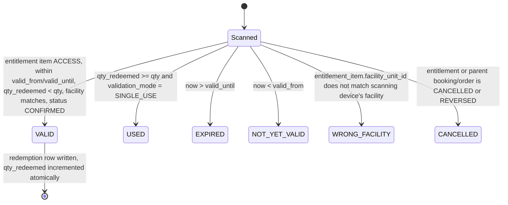
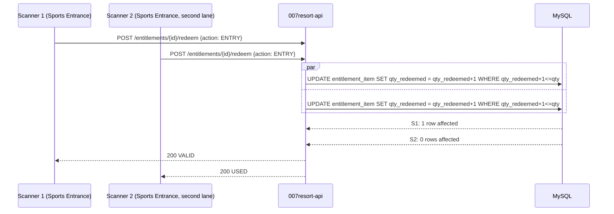

# 11 — Ticket / Entitlement Validation Model

Status: **DRAFT, awaiting review**. Domain model: [03 §3.4](03-domain-model.md#34-booking-tickets-entitlements-membership).

## 1. Validation states (per scan)

Every scan writes a `validation_event` row (scanner device, timestamp, result) regardless of outcome, for audit and for spotting a scanner being repeatedly tried against a used ticket ([spec §17](../spec/)).

## 2. Validation modes ([spec §14](../spec/))

| Mode | Behaviour |
| --- | --- |
| `NONE` | No validation performed (informational ticket only) |
| `SINGLE_USE` | First successful scan sets `qty_redeemed = qty`; further scans return `USED` |
| `MULTIPLE_ENTRY` | Each scan increments `qty_redeemed` up to `qty` (e.g. a 10-visit pass) |
| `TIME_LIMITED` | Valid only within `[valid_from, valid_until]`, combinable with the modes above |
| `ENTRY_EXIT` | Paired `ENTRY`/`EXIT` redemption rows; an `ENTRY` without a preceding open entry is required before `EXIT`; used for Pool (headcount-in-venue tracking) |
| `STAFF_APPROVAL` | Scan returns `PENDING`; a staff member with the override permission confirms before the redemption commits — this is the "manual ticket override" sensitive action ([06](06-roles-permissions.md)) |

Pool defaults to ticketing with `SINGLE_USE` (or `ENTRY_EXIT` where headcount tracking is wanted) per [spec §7.1](../spec/); the mode remains configurable per ticket type.

## 3. Individual vs. combined tickets ([spec §14](../spec/))

"3 children + 2 adults" produces **5 `entitlement` rows**, each with one `ACCESS` `entitlement_item` (qty 1), when the ticket type is configured `individual`. Configured `combined`, it produces **1 `entitlement`** with one `ACCESS` item of `qty = 5`, validated `MULTIPLE_ENTRY` up to 5 scans (or a single scan admitting the group, per `operating_rule`). Both are the same tables; only the ticket type's format flag differs.

## 4. Preventing double redemption — the concurrency test ([spec §26](../spec/))

Both requests race on the same row; InnoDB's row lock serializes them, so exactly one succeeds regardless of network timing or retries. This is a unit/integration test requirement ([18](18-testing-strategy.md)), not just a design intent.

## 5. Sports Entrance and Sports Store UX contract

- **Sports Entrance**: scan → `POST /entitlements/{id}/redeem {action: ENTRY, facilityUnitId}` → API returns one of `VALID, USED, EXPIRED, WRONG_FACILITY, NOT_YET_VALID, CANCELLED` verbatim ([spec §7](../spec/)) → tablet renders a single unambiguous full-screen result.
- **Sports Store**: scan → `GET /entitlements/{id}` (facility-scoped) → tablet renders exactly what was paid/rented (line items) → attendant releases (`RELEASE` redemption) or records a return (`RETURN` redemption) → duplicate release is blocked the same way as double entry, via the same conditional-update pattern on the `RENTAL` `entitlement_item`.
