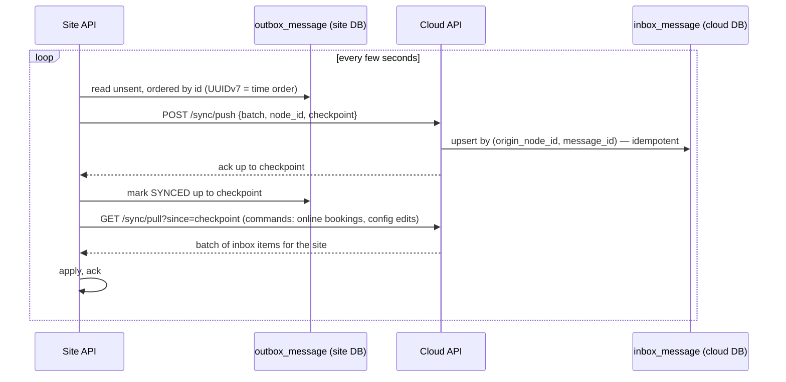
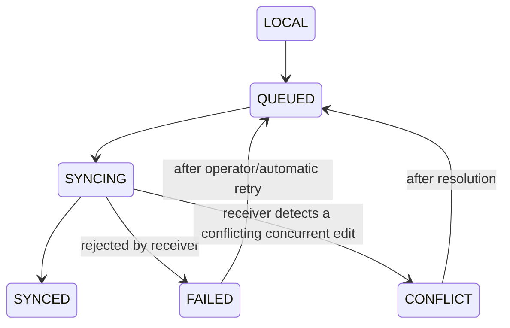

# 12 — Sync Strategy

Status: **DRAFT, awaiting review**. Related: [ADR-0005](../adr/0005-site-authoritative-local-first-with-outbound-sync.md), [13 Offline strategy](13-offline-strategy.md).

## 1. Topology

The **site** is authoritative for on-site operational data (orders, payments, inventory, bookings made at Reception, tickets, staff, attendance). The **cloud** is authoritative for online-customer-facing data (customer accounts, online bookings/payments before they land on-site, remote configuration edits, aggregated reporting). Sync is **outbound-initiated from the site**: the site never accepts inbound connections from the internet.

Transport is HTTPS/WSS, mutually authenticated (site holds a device/client certificate or a long-lived rotating secret issued at commissioning; see [17](17-security-model.md)). The connection is resilient to interruption: it simply resumes from the last acknowledged checkpoint.

## 2. What flows which way

| Data | Direction | Notes |
| --- | --- | --- |
| Orders, payments, inventory movements, on-site bookings/tickets, attendance | Site → Cloud | For remote reporting, backup, and disaster recovery. Read-only at the cloud |
| Online bookings/appointments, online payments, customer accounts | Cloud → Site | Site treats these as if made at Reception, subject to the same `slot_allocation` and entitlement rules |
| Staff/roles/permission/config/catalog/price edits made remotely | Cloud → Site | Delivered as versioned commands the site applies transactionally, never as raw table overwrites |
| Backups | Site → Cloud/NAS | Independent of the row-level sync channel — see [16](16-deployment-topology.md) |

## 3. Identifiers and idempotency

- Every sync-sensitive row uses a **UUIDv7 primary key** minted at the point of creation (site or cloud), so an id never collides regardless of where the row was born and stays roughly time-ordered for InnoDB write locality.
- `outbox_message` / `inbox_message` carry `(origin_node_id, message_id)` as the dedup key — replaying a batch after a dropped connection is safe.
- Applying an inbound command reuses the same `idempotency_record` mechanism as client requests ([04](04-database-schema.md)), so a redelivered command is a no-op the second time.

## 4. Sync states

`sync_state` on a row: `LOCAL` (not yet queued) → `QUEUED` (in the outbox) → `SYNCING` (batch sent, awaiting ack) → `SYNCED` (acked) → `FAILED` (rejected — schema/validation error, needs operator attention) → `CONFLICT` (see below).

## 5. Conflict handling

Two classes of conflict:

1. **Append-only facts** (orders, payments, movements, redemptions): these are never edited after creation, so there is nothing to conflict on — they just arrive and are inserted. The site's `slot_allocation`/`entitlement_item` uniqueness/quantity constraints are the actual truth; if an online booking and a Reception booking raced for the same slot, they raced **against the same site database**, not two independent copies (bookings are always written at the site — see [10](10-booking-state-model.md), §3) — so there is no cross-node booking conflict to resolve, by construction.
2. **Mutable configuration** (staff, roles, prices, facility config): last-writer-wins is **not** used. Each editable row carries a `version` counter; a remote command that targets a stale `version` is rejected into `sync_conflict` for a human (Manager/IT) to resolve in `007resort-admin-web`, rather than silently overwritten. This matches the spec's explicit sync states including `CONFLICT` ([spec §20](../spec/)).

## 6. Failure handling

A batch that fails validation at the receiver is not partially applied — the whole batch is rejected, logged as a `sync_failure` observability event ([17](17-security-model.md)), and retried after operator review if it indicates a real defect (vs. simply retried automatically for a transient error). The site continues operating locally regardless of sync health.
