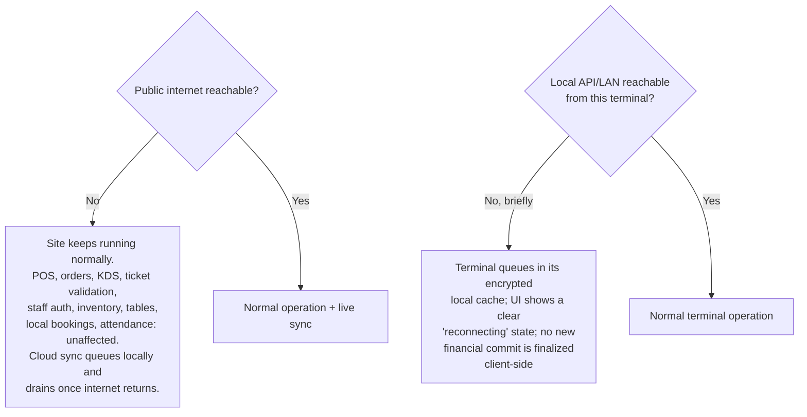

# 13 — Offline Strategy

Status: **DRAFT, awaiting review**

## 1. What "offline" means here

Two independent failure modes, handled differently:

1. **Public internet is down, LAN is fine.** This is the normal resilience target. All critical property operations continue unaffected because they only ever depended on the local server.
2. **The local server or LAN is briefly unreachable from a specific terminal** (Wi-Fi hiccup, cable fault, server restart). This is rarer and shorter-lived; it is handled by a small encrypted local queue on the client, not by the client running business logic.

## 2. What continues during a public-internet outage ([spec §19](../spec/))

| Function | Status during internet outage |
| --- | --- |
| POS sales and payments (cash, and any locally-processed electronic tender) | Fully operational |
| Orders, KDS routing, table/tab management | Fully operational |
| Ticket/entitlement validation | Fully operational (validated against the site DB) |
| Staff authentication | Fully operational (site issues its own sessions; not dependent on a cloud identity provider) |
| Inventory movements | Fully operational |
| Locally-known bookings (made at Reception) | Fully operational |
| Attendance (biometric terminal on LAN) | Fully operational |
| Operational reporting (site-local) | Fully operational |
| **Degraded**: online booking/payment portal, remote admin access, new online customer accounts, provider webhooks | Unavailable until connectivity returns — a public-facing, cloud-dependent concern by nature, not part of the site's local guarantee |
| **Degraded**: card/mobile-money payments if the payment provider itself requires live connectivity | Depends on the provider integration chosen; cash and any offline-capable tender remain available. Flagged for the payment-provider ADR ([20](20-open-questions.md)) |

## 3. Terminal-level resilience (the encrypted emergency queue)

Applies to `otueke-pos-desktop` and `otueke-mobile` per [spec §6, §19](../spec/):

- The client **never** runs pricing, tax, permission, stock, or entitlement logic locally — there is nothing to decide offline, only to queue.
- A queued action is a **request envelope**: endpoint, method, body, a client-generated `Idempotency-Key`, and a timestamp — encrypted at rest (platform keystore-backed key; AES-256).
- On reconnect, the client replays the queue **in order**, one in flight at a time, waiting for each response before sending the next. The server's idempotency layer ([04](04-database-schema.md), [12](12-sync-strategy.md)) makes a duplicated replay (e.g. client crashed after receiving the response but before marking it sent) safe.
- Actions unsafe to queue blind (anything whose validity depends on state that may have changed, e.g. "this is definitely the last unit") are still queued, but the UI marks the result as **pending confirmation** rather than assuming success — the confirmed truth is the server's response, shown when connectivity returns.
- The queue has a bounded size and age; if it fills or an item is too stale (configurable, e.g. > 30 minutes), the terminal blocks new sensitive actions (payments) and shows a clear "cannot confirm transactions — reconnect" state rather than accumulating unverifiable state. Non-sensitive actions (browsing catalog) remain usable from cached data.

## 4. What the KDS and Sports Entrance/Store do offline

- **KDS**: read-only display of the last-known board state if the SignalR connection drops; it cannot originate new tickets, so there is nothing to reconcile beyond reconnecting and resyncing state from the server.
- **Sports Entrance / Sports Store**: validation *requires* a live round-trip to the API by design (it is checking a shared, contended resource — see [11](11-ticket-validation-model.md)) and is not queued offline; if the local API is briefly unreachable the tablet shows a connectivity error rather than a guessed validation result, since a false `VALID` is a worse failure than a short delay.

## 5. Testing requirement

Simulated internet loss and simulated LAN/API loss are both **acceptance criteria** ([spec §20](../spec/)) and covered in [18](18-testing-strategy.md).
