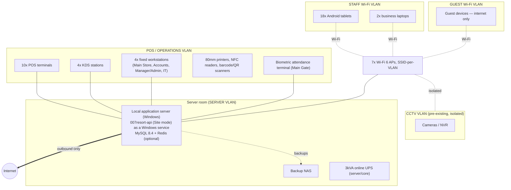
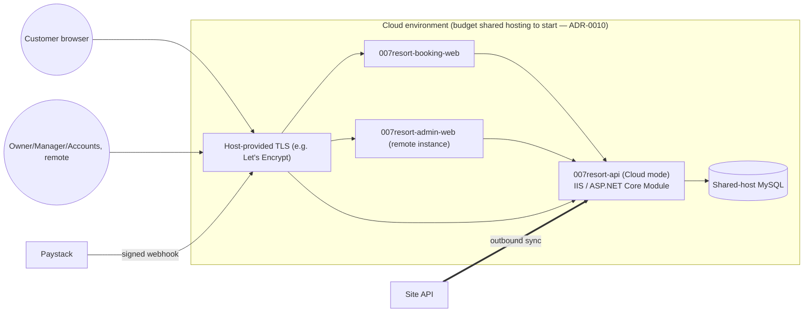

# 16 — Deployment Topology

Status: **DRAFT, awaiting review**. Hardware baseline: [spec §16](../spec/). Network design detail lives in `007resort-infrastructure/network/`.

## 1. On-site

- **Logical separation** ([spec §21](../spec/)): SERVER, POS/OPERATIONS, STAFF, GUEST as distinct VLANs on the existing/extended structured cabling ([spec §15](../spec/): 12 CAT6 cartons, 12x 25mm conduit runs, 7 APs). CCTV stays on its own pre-existing isolated network.
- **Guest Wi-Fi** has no route to POS, servers, printers, CCTV or any operational VLAN — enforced at the router/firewall, not by convention.
- Devices with fixed roles (POS, KDS, workstations, printers, gate terminal) get **DHCP reservations** on the OPERATIONS VLAN; tablets and laptops join per-VLAN SSIDs.
- Power: all 10 POS + 4 workstations + 4 KDS on `1000VA` UPS units per the hardware baseline; server/core network gear on the `3kVA` online UPS; server room has its own AC (`1.5HP inverter split`) per spec.

## 2. Cloud

- **Starting tier ([ADR-0010](../adr/0010-cloud-hosting-platform.md)):** a budget Windows/.NET-capable shared hosting plan (e.g. SmarterASP.NET or equivalent), chosen for cost. No dedicated load balancer/WAF or private network path at this tier — the host's own TLS and firewalling stand in for those, which is an accepted trade-off, not an oversight. Confirm the plan's MySQL version and WebSocket support before relying on either.
- **Upgrade path:** Microsoft Azure (App Service + Azure Database for MySQL Flexible Server + Key Vault + Front Door) once traffic, secret-management needs, or DR requirements outgrow shared hosting ([ADR-0010](../adr/0010-cloud-hosting-platform.md)). This topology was written to be portable across either tier — moving up is a deployment change, not a redesign.
- The site's local MySQL is **never** exposed to the internet, directly or via port-forward; only the outbound sync/admin channel exists ([spec §20, §21](../spec/)).
- Cloud `007resort-admin-web` and `007resort-booking-web` reach `007resort-api` (Cloud mode) over whatever internal path the hosting tier offers (a private network path once on a full cloud platform; likely just an internal hostname/loopback on shared hosting where both run on the same box).

## 3. Environments

| Environment | Purpose | Notes |
| --- | --- | --- |
| `local` (developer machine) | Development | `007resort-infrastructure/compose/dev` (MySQL 8.4 + Redis) |
| `staging` (cloud) | Pre-production validation, training environment ([spec §19, §28](../spec/)) | Mirrors cloud topology at smaller scale |
| `site-production` | The 007 Resort & Spa property | On-site server, per §1 |
| `cloud-production` | Public site, booking, remote admin, backups | Per §2 |

## 4. Commissioning checklist (summary — full runbook in `007resort-infrastructure`)

Confirm facility map/network outlets → install/terminate/test structured cabling and APs → prepare server room (power, cooling, rack) → install local server, MySQL, backups → configure facilities/products/roles/rules/inventory locations → deploy POS/workstations/KDS/printers/NFC/scanners/tablets → configure staff identities/NFC/attendance → configure cloud environment, website, remote admin → run data-integrity, payment, booking, ticket, offline/recovery tests → train staff → pilot selected facilities → acceptance testing, documentation, handover ([spec §19](../spec/)).
