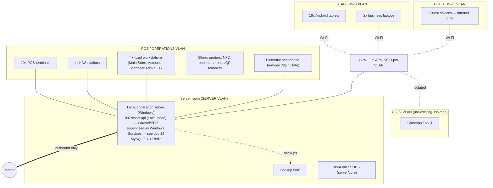

# 16 — Deployment Topology

Status: **DRAFT, awaiting review**. Hardware baseline: [spec §16](../spec/). Network design detail lives in `007resort-infrastructure/network/`.

> **Backend/hosting update ([ADR-0012](../adr/0012-migrate-backend-to-laravel.md), [ADR-0013](../adr/0013-dual-node-local-cloud-sync.md), [ADR-0014](../adr/0014-cloud-node-requires-vps-supersedes-shared-hosting.md)):** the backend is now Laravel/PHP (not ASP.NET Core), and the Cloud node runs on a VPS with root access (not shared hosting). §1 below still describes the correct on-site network topology; the process (Windows Service) running on `SRV` is now Laravel/PHP, detailed fully in [26 — Windows Local Server Deployment Spec](26-windows-local-server-deployment.md). §2's diagram is superseded by [25 — VPS Production Deployment Spec](25-vps-production-deployment.md).

## 1. On-site

- **Logical separation** ([spec §21](../spec/)): SERVER, POS/OPERATIONS, STAFF, GUEST as distinct VLANs on the existing/extended structured cabling ([spec §15](../spec/): 12 CAT6 cartons, 12x 25mm conduit runs, 7 APs). CCTV stays on its own pre-existing isolated network.
- **Guest Wi-Fi** has no route to POS, servers, printers, CCTV or any operational VLAN — enforced at the router/firewall, not by convention.
- Devices with fixed roles (POS, KDS, workstations, printers, gate terminal) get **DHCP reservations** on the OPERATIONS VLAN; tablets and laptops join per-VLAN SSIDs.
- Power: all 10 POS + 4 workstations + 4 KDS on `1000VA` UPS units per the hardware baseline; server/core network gear on the `3kVA` online UPS; server room has its own AC (`1.5HP inverter split`) per spec.

## 2. Cloud

Superseded by [25 — VPS Production Deployment Spec](25-vps-production-deployment.md) per [ADR-0014](../adr/0014-cloud-node-requires-vps-supersedes-shared-hosting.md): the Cloud node is a Linux VPS with root access (Nginx, PHP-FPM, Laravel, MySQL 8.4, Redis, Reverb, Supervisor-managed workers), not shared hosting. The core principles below remain true regardless of hosting tier:

- The site's local MySQL is **never** exposed to the internet, directly or via port-forward; only the outbound sync channel exists ([ADR-0005](../adr/0005-site-authoritative-local-first-with-outbound-sync.md), [ADR-0013](../adr/0013-dual-node-local-cloud-sync.md)).
- `007resort-admin-web` (remote instance) and `007resort-booking-web` reach `007resort-api` (Cloud node) over a private/local path on the same VPS (or an internal network if later split across hosts) — never over the public internet for this internal call.
- Online customers and remote admin/management traffic terminate at Cloud only; the property's Local node is never the public-facing backend for any of it ([ADR-0013](../adr/0013-dual-node-local-cloud-sync.md) §5).

## 3. Environments

| Environment | Purpose | Notes |
| --- | --- | --- |
| `local` (developer machine) | Development | `007resort-infrastructure/compose/dev` (MySQL 8.4 + Redis) |
| `staging` (cloud) | Pre-production validation, training environment ([spec §19, §28](../spec/)) | Mirrors cloud topology at smaller scale |
| `site-production` | The 007 Resort & Spa property | On-site server, per §1 |
| `cloud-production` | Public site, booking, remote admin, backups | Per §2 |

## 4. Commissioning checklist (summary — full runbook in `007resort-infrastructure`)

Confirm facility map/network outlets → install/terminate/test structured cabling and APs → prepare server room (power, cooling, rack) → install local server, MySQL, backups → configure facilities/products/roles/rules/inventory locations → deploy POS/workstations/KDS/printers/NFC/scanners/tablets → configure staff identities/NFC/attendance → configure cloud environment, website, remote admin → run data-integrity, payment, booking, ticket, offline/recovery tests → train staff → pilot selected facilities → acceptance testing, documentation, handover ([spec §19](../spec/)).
