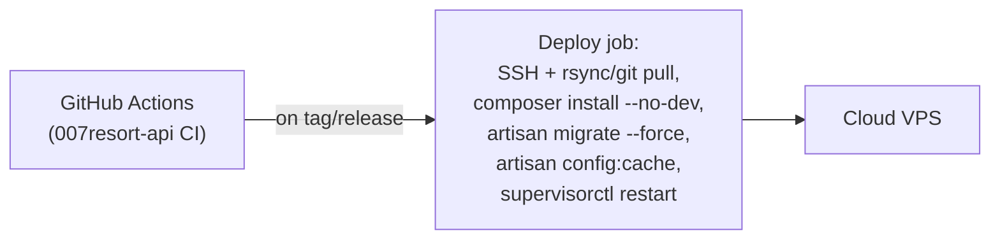

# 25 — VPS Production Deployment Specification (Cloud Node)

Status: **DRAFT, awaiting review**. Per [ADR-0014](../adr/0014-cloud-node-requires-vps-supersedes-shared-hosting.md), superseding the shared-hosting plan in [ADR-0010](../adr/0010-cloud-hosting-platform.md).

## 0. No resources provisioned yet

This is a specification, not a provisioned environment. Creating the actual VPS requires the owner's account/billing action; nothing here has been executed against a real server.

## 1. Sizing (initial target, not a ceiling)

| Resource | Initial target |
| --- | --- |
| vCPU | ~4 |
| RAM | ~8 GB |
| Storage | ~100–160 GB SSD/NVMe |
| OS | Linux (Ubuntu LTS recommended — widest first-party package/support availability for the stack below) |
| Access | Root/administrative |
| Backup | Provider-level automated snapshot capability, **in addition to** application-level backup (§8) — provider snapshots alone are not a substitute, per the "backup is not synchronization/backup is not just a VM snapshot" principle |

Provider is an implementation-time choice (DigitalOcean, Hetzner, Vultr, Contabo and similar all fit this profile) — not fixed by this ADR/spec, since the point of moving to a VPS is root control and right-sizing, not a specific vendor.

## 2. Software stack

| Layer | Choice |
| --- | --- |
| Web server | Nginx (reverse proxy to PHP-FPM) |
| PHP runtime | PHP-FPM, current LTS-compatible version for the chosen Laravel release |
| Application | Laravel (`APP_NODE=cloud`) |
| Database | MySQL 8.4, InnoDB, `utf8mb4` — same conventions as Local ([architecture/04](04-database-schema.md)), same server, or a managed MySQL add-on from the VPS provider if offered and cost-effective |
| Cache/queue/broadcasting backing store | Redis |
| Real-time | Laravel Reverb (self-hosted WebSocket server) or a Pusher-protocol-compatible service, behind Nginx as a WebSocket-upgrading reverse proxy |
| Process supervision | Supervisor (or systemd unit files) for: `php-fpm`, queue workers (`artisan queue:work`, multiple, per queue), the scheduler (`artisan schedule:run` via cron, or a long-running `schedule:work`), Reverb, and the sync outbox/inbox workers |
| TLS | Let's Encrypt via Certbot, auto-renewing |
| Firewall | `ufw` (or provider firewall) — only 80/443 (and the SSH port, key-only auth) open publicly; MySQL/Redis bound to localhost only, never public |
| Secrets | `.env`, file-permission-restricted (owned by the deploy user, `600`), **not** committed; consider a proper secrets manager (e.g. a self-hosted Vault, or the provider's secret store if offered) as a near-term follow-up rather than a hard requirement for the first deployment |

## 3. Deployment pipeline

- Deployment key is a dedicated, VPS-scoped SSH key stored as a GitHub Actions secret — never a personal key, never committed.
- `artisan migrate --force` runs the same versioned SQL-backed migrations as Local (see [ADR-0012](../adr/0012-migrate-backend-to-laravel.md)) — one migration history, applied to both nodes' independent databases.
- Zero-downtime is not a hard requirement at Phase-1-of-this-migration scale; a brief `php artisan down` maintenance window during deploy is acceptable and should be explicit rather than silently dropping in-flight requests.

## 4. Network exposure (what's public vs. not)

| Component | Exposure |
| --- | --- |
| Nginx (80/443 → `007resort-booking-web`, `007resort-admin-web` remote instance, `007resort-api` Cloud endpoints) | Public |
| Reverb WebSocket endpoint | Public (behind Nginx, TLS) — needed for browser-connected real-time features if any exist at Cloud (KDS itself is Local-only per [Domain Authority Matrix](23-domain-authority-matrix.md), but Cloud may still need real-time for e.g. a live owner dashboard) |
| MySQL | **Never public** — localhost/private-network only |
| Redis | **Never public** — localhost only |
| SSH | Key-only auth, ideally restricted to known IPs or a bastion, consistent with the "never expose the operational platform's internals" principle already established for Local ([architecture/17](17-security-model.md)) |
| Sync endpoint (`/api/v1/sync/*`) | Public but mutually authenticated (Local's outbound calls carry a node credential) — this is the *only* channel Local ever calls, and Cloud never calls Local |

## 5. Monitoring

- Structured JSON logs (Serilog-equivalent — Laravel's `Monolog` with a JSON formatter), shipped to a log file with rotation at minimum; a hosted log aggregator (if budget allows) is a near-term follow-up, not a blocking requirement.
- Process supervisor alerts (email/webhook) on a supervised process (queue worker, Reverb, PHP-FPM) crashing and failing to restart.
- The [Heartbeat / Node Health](sync/heartbeat-and-node-health.md) mechanism doubles as an application-level liveness signal for Local, visible in `007resort-admin-web`.

## 6. Backup and disaster recovery

Independent of synchronization (per [ADR-0013](../adr/0013-dual-node-local-cloud-sync.md) consequences):

- Automated MySQL logical backup (`mysqldump` or `mydumper`) on a schedule (e.g. nightly full + more frequent binlog-based point-in-time recovery), stored **off the VPS itself** (object storage, or pulled to a second location) — a VPS-local-only backup does not survive the VPS itself being lost.
- Application code and `.env` structure (not secret values) are already recoverable from Git; only data and secret material need dedicated backup.
- Quarterly (at minimum) restore test, per the same discipline required for Local ([architecture/16](16-deployment-topology.md)).

## 7. Commissioning checklist (summary)

Provision VPS → harden (firewall, SSH key-only, fail2ban or equivalent) → install stack → configure MySQL/Redis (localhost-bound) → deploy Laravel via the pipeline above → configure Nginx + TLS → configure Supervisor units for all long-running processes → configure automated off-VPS backups → configure monitoring/alerting → run the sync/heartbeat handshake against a test Local instance before go-live → verify the distributed-system test scenarios ([architecture/18](18-testing-strategy.md), extended per [22 — Migration Impact Assessment](22-migration-impact-assessment.md)) against the real deployed pair.
