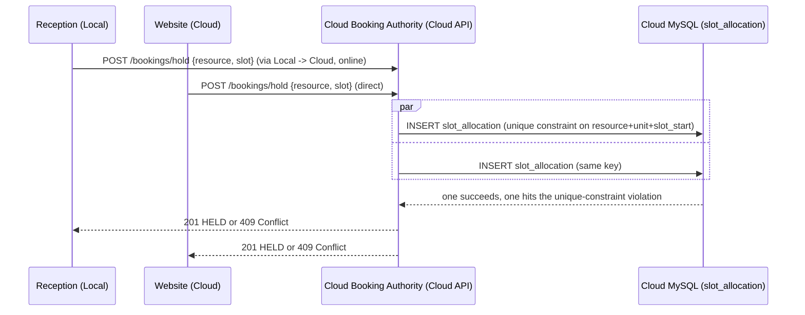
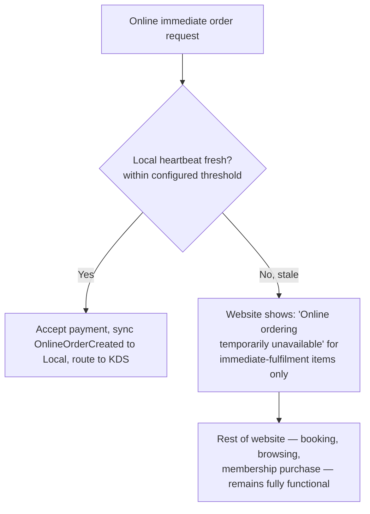

# Booking Authority & Offline Allocation Strategy

Status: **DRAFT, awaiting review**. Companion to [ADR-0013](../../adr/0013-dual-node-local-cloud-sync.md) and the [Domain Authority Matrix](../23-domain-authority-matrix.md).

## 1. The problem, precisely

A shared-capacity resource (a tennis court at 4pm, the last pool ticket in a time band) can be requested from **two independent entry points at once** — Reception (Local) and the website (Cloud). If both entry points can independently confirm a reservation, they can both confirm the *same* one. Preventing this requires the check-and-reserve step to be atomic against **one** decision point, not two databases that reconcile afterward.

## 2. Normal operation (internet reachable): Cloud Booking Authority

Both channels compete against the **same** `slot_allocation` table and the **same** unique constraint `(resource_id, unit_no, slot_start)` already designed in [architecture/04 §3.1](../04-database-schema.md#31-slot_allocation--prevents-double-booking) and [architecture/10 §3](../10-booking-state-model.md#3-preventing-the-two-users-one-final-slot-race) — this is not new mechanism, it is that same mechanism, now explicitly located at Cloud as the single decision point when Cloud is reachable. Reception's request travels Local → Cloud (an ordinary API call, not a sync event, because this needs a synchronous answer) rather than Reception deciding locally.

## 3. Offline operation: per-resource configurable strategy

When Local cannot reach Cloud, three configurable strategies exist, chosen **per facility/resource** by an authorized Manager/IT role, not hardcoded platform-wide:

### A. Offline Allocation (default recommendation for most sports/spa resources)

A resource's total capacity is split at configuration time into a **Cloud pool** and a **Local offline reserve** (e.g. total 20 → Cloud 15, Local reserve 5). During an outage, Cloud continues committing only from its pool; Reception commits only from the Local reserve. Both pools use the same atomic unique-constraint mechanism, just scoped to disjoint slot/unit ranges, so there is no possibility of the two pools double-booking the same physical unit even while disconnected. On reconnection, a reconciliation job merges both pools' bookings into the single canonical `slot_allocation` table at Cloud (no conflict is possible here by construction — the ranges never overlapped) and reports any pool that ran over its allocation as an operational alert (e.g. a manual override was used), not a silent auto-resolution.

### B. Online Authority Required

For resources where any overbooking is unacceptable (e.g. a resource with true single-unit capacity and no safe reserve to carve out), Reception's booking flow itself requires a live connection to Cloud before confirming — shown to staff as "requires connectivity to book." Per [ADR-0013](../../adr/0013-dual-node-local-cloud-sync.md) and the original spec-equivalent requirement, **this restriction applies only to that specific resource's booking flow** — it must not disable or slow down unrelated local operations (restaurant POS, supermarket POS, KDS, cash transactions, attendance, inventory all continue normally).

### C. Temporarily Disable Online Availability

For a configured resource, Management may set a heartbeat-staleness threshold beyond which the *website* stops offering that resource for booking (rather than risking an online booking Local can't yet confirm applies against remaining offline-reserve capacity). This is the Cloud-side mirror of strategy B — instead of blocking Reception, it blocks the website for that resource specifically, again without taking down the rest of the site.

The strategy (A/B/C) and its parameters (pool split, staleness threshold) are `operating_rule` data on the resource's `facility_capability`, following the existing capability-engine pattern ([ADR-0008](../../adr/0008-facility-capability-engine.md)) — configuration, not code.

## 4. Immediate Online Orders

Distinguish **immediate fulfilment** (a food/drink order the property must act on right now) from **future scheduled activity** (a booking for next Saturday). The Booking Authority concept above governs the latter; immediate orders have a different, simpler rule:

The Cloud node must not accept payment for an immediate order it cannot reasonably expect the property to act on. This check happens **before** payment capture, not after — an order is never accepted-then-cancelled for connectivity reasons if it can be avoided by not accepting it in the first place. See [Heartbeat / Node Health](heartbeat-and-node-health.md) for the staleness mechanism this depends on.

## 5. What this explicitly does not do

- It does not make every booking wait on a network round-trip in the common case — strategy A (offline allocation) is the default precisely so Reception keeps functioning at normal speed during the (hopefully rare, but planned-for) outage window.
- It does not solve capacity planning — the Cloud/Local pool split is an operational decision for Management to tune based on observed demand patterns, not something the architecture can decide for them.
