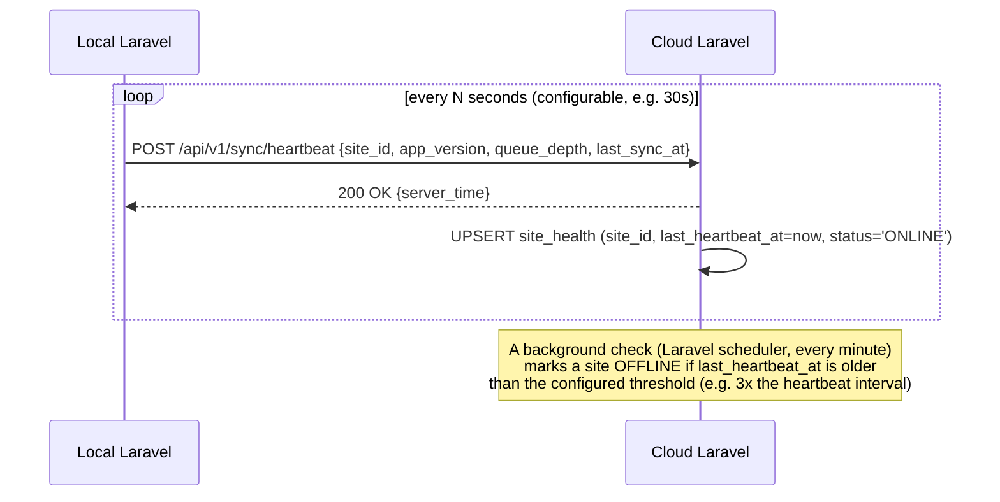

# Heartbeat / Node Health Specification

Status: **DRAFT, awaiting review**. Companion to [ADR-0013](../../adr/0013-dual-node-local-cloud-sync.md).

## 1. Purpose

Cloud needs to know, at any moment, whether Local is currently reachable and how stale its last successful contact is — used to gate immediate-fulfilment online orders ([Booking Authority §4](booking-authority-and-offline-allocation.md#4-immediate-online-orders)) and to show honest data-freshness in remote reporting ([architecture/16](../16-deployment-topology.md)), without needing a human to notice the property "seems quiet."

## 2. Mechanism



- The heartbeat is a Local→Cloud outbound call, consistent with the outbound-only rule ([ADR-0005](../../adr/0005-site-authoritative-local-first-with-outbound-sync.md)) — Cloud never polls Local.
- It piggybacks a small amount of useful state (queue depth, last successful sync timestamp, app version) so a single call answers "is it online" and "is it healthy" together, without a separate health-check protocol.
- Marking a site `OFFLINE` requires **missing several consecutive heartbeats**, not one failed request — a single dropped packet must not flip the whole system into degraded-mode behavior (per [ADR §32](../../adr/0013-dual-node-local-cloud-sync.md) equivalent requirement and the original spec's "do not mark the site offline because of one failed request").

## 3. `site_health` (Cloud-side)

```sql
CREATE TABLE site_health (
  site_id           BINARY(16) NOT NULL PRIMARY KEY,
  status            VARCHAR(16) NOT NULL DEFAULT 'UNKNOWN'
                      CHECK (status IN ('ONLINE','OFFLINE','UNKNOWN')),
  last_heartbeat_at DATETIME(6) NULL,
  last_sync_at      DATETIME(6) NULL,
  app_version       VARCHAR(32) NULL,
  queue_depth       INT UNSIGNED NULL,
  updated_at        DATETIME(6) NOT NULL DEFAULT CURRENT_TIMESTAMP(6) ON UPDATE CURRENT_TIMESTAMP(6)
) ENGINE=InnoDB;
```

## 4. Observability requirements

Admin/IT (via `007resort-admin-web`'s remote instance, reading Cloud) must be able to see, without direct database access:

- Site online/offline status and last heartbeat time.
- Last successful sync timestamp (separate from heartbeat — a site can be "online" but have a stuck sync queue).
- Outbox queue depth and oldest unsynced event's age, at both nodes.
- Recent sync failures and conflicts, with enough detail to act (not just "sync failed").
- A controlled retry/reprocess action for a failed or conflicted event, restricted to IT/Admin permission ([architecture/06](../06-roles-permissions.md)) and itself audited.

## 5. Example presentation (reporting dashboard)

```text
PROPERTY: 007 Resort & Spa
STATUS:            ONLINE
LAST HEARTBEAT:     21:41:03  (12s ago)
LAST SUCCESSFUL SYNC: 21:40:58  (17s ago)
OUTBOX QUEUE DEPTH: 0
```

versus, during an outage:

```text
PROPERTY: 007 Resort & Spa
STATUS:            OFFLINE
LAST CONTACT:       21:41  (7 minutes ago)
LAST SUCCESSFUL SYNC: 21:40  (8 minutes ago)
OUTBOX QUEUE DEPTH: 42 events pending (oldest: 6 minutes)
```

Remote reporting views must never present Local-originated figures (today's revenue, current stock) as live/confirmed when the underlying sync is stale — the dashboard shows the staleness inline rather than the consuming manager having to separately check a health page to know whether to trust the number.
