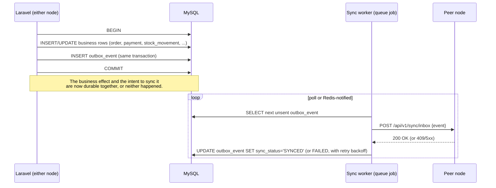
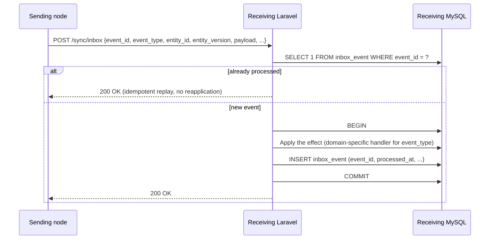

# Outbox / Inbox Design

Status: **DRAFT, awaiting review**. Companion to [ADR-0013](../../adr/0013-dual-node-local-cloud-sync.md) and the [Event Catalogue](event-catalogue.md).

## 1. Why outbox/inbox, not "just call the other node's API"

A naive design — commit the local change, then make an HTTP call to Cloud — loses the event if the HTTP call fails (which it will, routinely, given the property's internet is explicitly allowed to be unreliable). The outbox pattern makes "the event will eventually be sent" part of the same database transaction as the business change itself, so a lost network call can never mean a lost business transaction ([spec-equivalent requirement, §25](../../spec/)).

## 2. Local write path



- The outbox table lives in the **same** MySQL database as the business tables it references, so the `INSERT` into it is genuinely atomic with the business write — never a separate database, never a separate transaction.
- A Laravel queued job (backed by Redis, per [ADR-0012](../../adr/0012-migrate-backend-to-laravel.md)) drains the outbox. If Redis or the worker is down, events sit safely in MySQL until it recovers — **nothing is lost**, only delayed (this satisfies the "Redis/queue worker temporarily stops, committed transactions are not lost" test scenario).
- Delivery is **outbound-initiated only**, from whichever node has the event, consistent with [ADR-0005](../../adr/0005-site-authoritative-local-first-with-outbound-sync.md) — Local never accepts an unsolicited inbound connection from the internet; it pushes to Cloud, and pulls from Cloud via the same outbound-initiated channel (Cloud queues events for Local; Local polls/pulls them, it is never "called").

## 3. Receiving path (inbox)



- `inbox_event.event_id` is `UNIQUE` — the same guard pattern already designed for `provider_event` and `idempotency_record` ([architecture/04 §3.3](../04-database-schema.md#33-provider_event-and-idempotency_record--duplicate-payment-protection)), reused here rather than invented fresh.
- A version-sensitive event (configuration, staff roster) checks `entity_version` against the local row before applying; a stale version is not applied — it's recorded as a `CONFIGURATION_CONFLICT`/`PERMISSION_CONFLICT` row for manual resolution (see [Conflict Resolution Matrix](conflict-resolution-matrix.md)), and the sender is still told `200 OK` (the event was *received and evaluated*, not lost — the conflict is the outcome, not a delivery failure).
- Handlers are dispatched by `event_type` to a domain-specific applier (e.g. `Domain\Sync\Appliers\OrderCreatedApplier`) — this keeps the inbox controller thin and the actual "what does receiving an `OnlineBookingCreated` event mean" logic inside the Booking domain module, honoring the modular-monolith boundary from [ADR-0002](../../adr/0002-modular-monolith.md).

## 4. Ordering

Most events don't depend on strict ordering (an `OrderCreated` and an unrelated `StockReceived` can apply in any order). Where ordering *does* matter (an entity's own event sequence — `OrderCreated` before `OrderCancelled` for the *same* order), the applier checks `entity_version`: an event whose expected prior version doesn't match the local row's current version is deferred (re-queued for a short backoff and retried) rather than applied out of order and corrupting state, per [ADR-0013](../../adr/0013-dual-node-local-cloud-sync.md) §4 and the "events arrive out of order, entity state remains valid" test scenario.

## 5. Schema sketch

```sql
CREATE TABLE outbox_event (
  id              BINARY(16) NOT NULL PRIMARY KEY,   -- = event_id
  event_type      VARCHAR(64) NOT NULL,
  entity_type     VARCHAR(64) NOT NULL,
  entity_id       BINARY(16) NOT NULL,
  entity_version  INT UNSIGNED NOT NULL,
  organization_id BINARY(16) NOT NULL,
  site_id         BINARY(16) NULL,
  facility_id     BINARY(16) NULL,
  payload         JSON NOT NULL,
  sync_status     VARCHAR(16) NOT NULL DEFAULT 'LOCAL'
                    CHECK (sync_status IN ('LOCAL','QUEUED','SYNCING','SYNCED','CONFLICT','FAILED')),
  retry_count     INT UNSIGNED NOT NULL DEFAULT 0,
  last_attempt_at DATETIME(6) NULL,
  last_error      JSON NULL,
  created_at      DATETIME(6) NOT NULL DEFAULT CURRENT_TIMESTAMP(6),
  INDEX ix_outbox_status (sync_status, created_at)
) ENGINE=InnoDB;

CREATE TABLE inbox_event (
  id              BINARY(16) NOT NULL PRIMARY KEY,   -- = event_id, from the sender
  event_type      VARCHAR(64) NOT NULL,
  source_node     VARCHAR(16) NOT NULL,
  received_at     DATETIME(6) NOT NULL DEFAULT CURRENT_TIMESTAMP(6),
  processed_at    DATETIME(6) NULL,
  result          VARCHAR(16) NOT NULL DEFAULT 'PENDING'
                    CHECK (result IN ('PENDING','APPLIED','CONFLICT','FAILED')),
  conflict_detail JSON NULL
) ENGINE=InnoDB;
```

This reuses the exact conventions (`BINARY(16)` UUIDs, `CHECK`-constrained status enums, `DATETIME(6)` UTC) already established and verified against real MySQL 8.4 in [ADR-0003](../../adr/0003-identifier-and-money-conventions.md) and the Phase 1 migration — nothing new is invented here, it's the same pattern applied to sync.

## 6. What this deliberately does not do

- It does not attempt exactly-once *delivery* (that's impossible over an unreliable network) — it achieves exactly-once *effect* via the receiver-side idempotency check, which is the achievable and sufficient guarantee.
- It does not guarantee global ordering across all events — only per-entity ordering, via version checks, which is what actually matters for correctness.
- It is not a general-purpose message bus — it is scoped specifically to Local↔Cloud synchronization for this platform, not a pattern for arbitrary internal Laravel event handling (Laravel's own events/listeners remain the right tool for in-process concerns).
