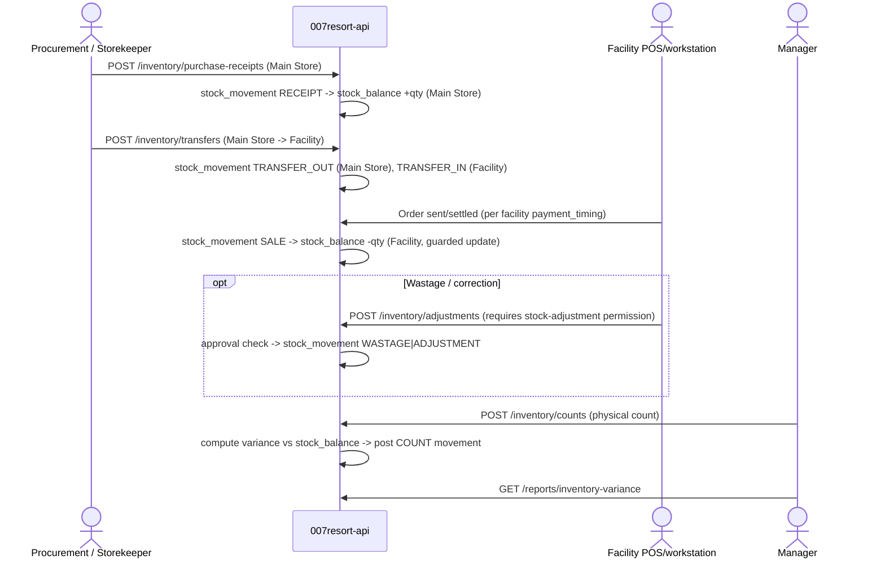

# Workflow: Inventory receipt through sale

Every movement records item, source, destination, quantity, actor, timestamp and reason/reference — see [09 Inventory movement model](../architecture/09-inventory-movement-model.md).
