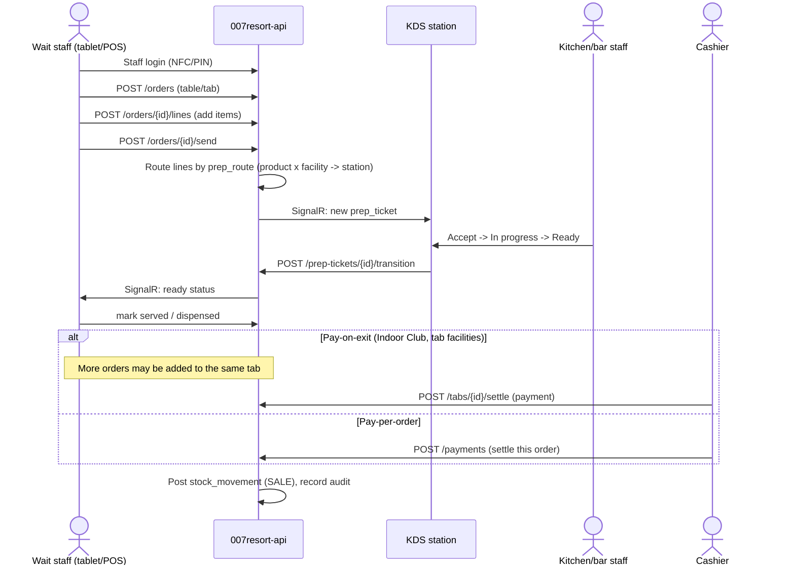

# Workflow: Restaurant / Bar service

Facilities: Restaurant, Indoor Club, Pool Bar, Bush Bar / Event Centre (varying `payment_timing` per [05](../architecture/05-facility-capability-model.md)).

See [08 Order state model](../architecture/08-order-state-model.md) and [09 Inventory movement model](../architecture/09-inventory-movement-model.md) for the underlying state machines.
