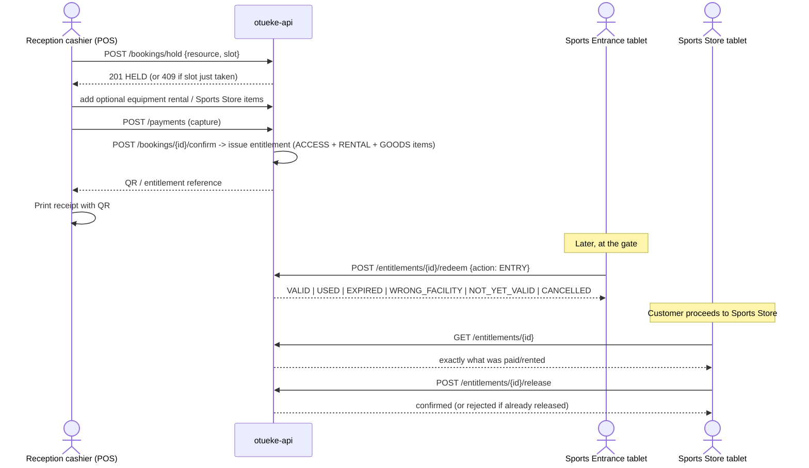

# Workflow: Sports booking, ticketing and equipment

Reception handles payment for Pool, Sports Arena, Sports Store, equipment rental and Pool Bar ([spec §6](../spec/)); neither Sports Arena nor Sports Store has its own payment terminal.

See [10 Booking state model](../architecture/10-booking-state-model.md) and [11 Ticket / entitlement validation model](../architecture/11-ticket-validation-model.md) for the full state machines and the double-redemption concurrency guard.
