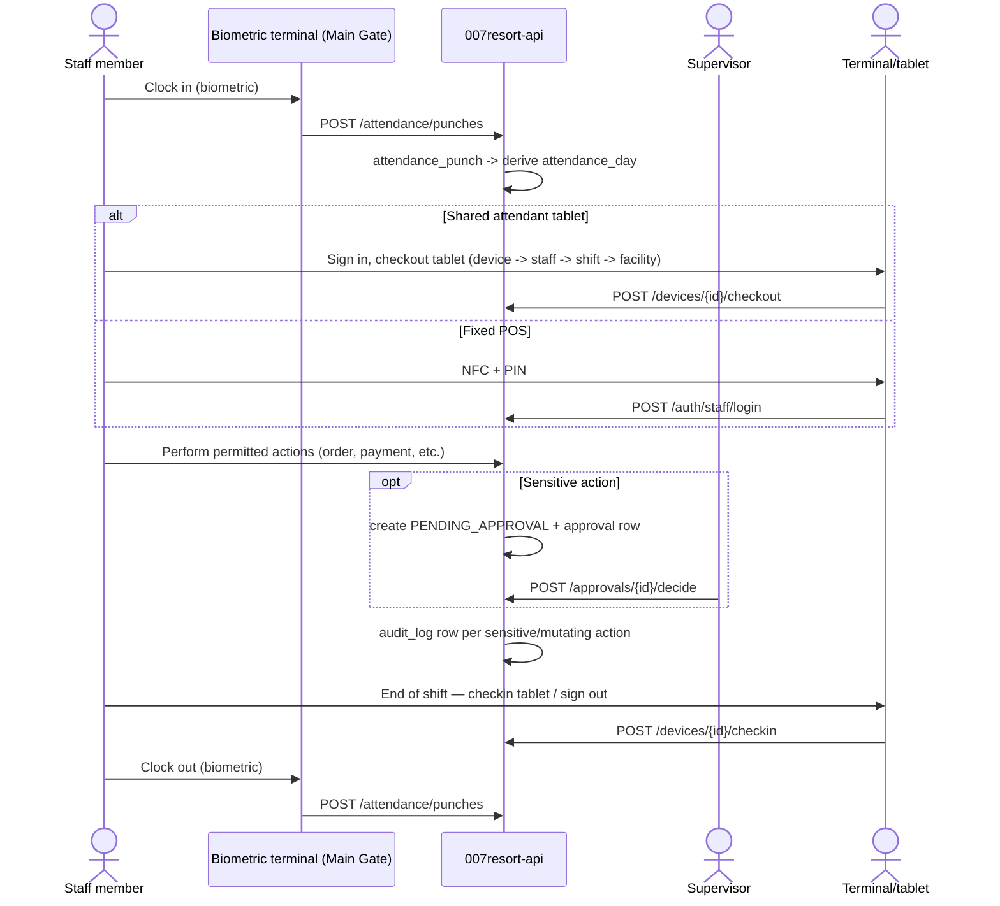

# Workflow: Staff shift, from clock-in to clock-out

See [06 Roles and permissions matrix](../architecture/06-roles-permissions.md) for authentication requirements per station type and the approval workflow, and [17 Security model](../architecture/17-security-model.md) for audit requirements.
